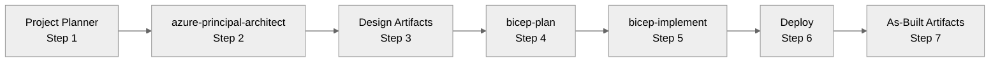

# Agentic InfraOps - Copilot Instructions

> **Agentic InfraOps** - Azure infrastructure engineered by agents. Verified. Well-Architected. Deployable.

## Quick Reference

| Rule                | Value                                                                                    |
| ------------------- | ---------------------------------------------------------------------------------------- |
| **Default Region**  | `swedencentral` (alt: `germanywestcentral`)                                              |
| **Unique Names**    | `var uniqueSuffix = uniqueString(resourceGroup().id)` in main.bicep, pass to ALL modules |
| **Key Vault**       | ≤24 chars: `kv-{short}-{env}-{suffix}`                                                   |
| **Storage Account** | ≤24 chars, lowercase+numbers only, NO hyphens                                            |
| **SQL Server**      | ≤63 chars, Azure AD-only auth                                                            |
| **Zone Redundancy** | App Service Plans: P1v4+ (not S1/P1v2)                                                   |
| **Deploy Scripts**  | `[CmdletBinding(SupportsShouldProcess)]` + `$WhatIfPreference`                           |

**Critical Files:**

- Agent definitions: `.github/agents/*.agent.md`
- Shared defaults: `.github/agents/_shared/defaults.md` (regions, tags, AVM, security)
- Plan requirements: `.github/prompts/plan-requirements.prompt.md` (comprehensive NFR capture)
- Workflow guide: `docs/reference/workflow.md`
- Reference docs: `docs/reference/` (defaults, workflow, agents-overview, bicep-patterns)
- Line endings: `.gitattributes` (use `* text=auto eol=lf` for cross-platform)

## Repository Purpose

**Agentic InfraOps** transforms requirements into deploy-ready Azure infrastructure using coordinated AI agents,
aligned with Azure Well-Architected Framework and Azure Verified Modules.

**Audience**: SI partners delivering Azure projects • IT Pros learning IaC • Customers evaluating agentic workflows

## Seven-Step Workflow



| Step | Agent                                | Output                          |
| ---- | ------------------------------------ | ------------------------------- |
| 1    | `project-planner`                    | `01-requirements.md`            |
| 2    | `azure-principal-architect`          | `02-architecture-assessment.md` |
| 3    | `diagram-generator`, `adr-generator` | `03-des-*.md/.py/.png`          |
| 4    | `bicep-plan`                         | `04-implementation-plan.md`     |
| 5    | `bicep-implement`                    | `infra/bicep/{project}/`        |
| 6    | Deploy                               | `06-deployment-summary.md`      |
| 7    | `workload-documentation-generator`   | `07-*.md`                       |

**How to use agents**: `Ctrl+Alt+I` → select agent from picker → type prompt → wait for approval before next step

📖 **Full workflow details**: `docs/reference/workflow.md`

## Project Structure

```
azure-agentic-infraops/
├── .github/
│   ├── agents/                  # 7 custom agents
│   │   ├── _shared/defaults.md  # Regions, tags, AVM, security
│   │   └── *.agent.md           # Agent definitions
│   ├── instructions/            # File-type specific rules
│   └── copilot-instructions.md  # THIS FILE
├── agent-output/{project}/      # Agent-generated artifacts
├── infra/bicep/                 # Generated Bicep templates
├── scenarios/                   # Demo scenarios S01-S08
├── docs/                        # Documentation
│   └── reference/               # Single source of truth (incl. workflow.md)
└── mcp/azure-pricing-mcp/       # Azure Pricing MCP server
```

## Tech Stack

| Category            | Tools                                           |
| ------------------- | ----------------------------------------------- |
| **IaC**             | Bicep (primary), Terraform (optional)           |
| **Automation**      | PowerShell 7+, Azure CLI 2.50+, Bicep CLI 0.20+ |
| **Platform**        | Azure (public cloud)                            |
| **AI**              | GitHub Copilot with custom agents               |
| **Dev Environment** | VS Code Dev Container (Ubuntu 24.04)            |

## Critical Patterns

### Unique Resource Names

```bicep
// main.bicep - Generate once, pass to ALL modules
var uniqueSuffix = uniqueString(resourceGroup().id)

module keyVault 'modules/key-vault.bicep' = {
  params: { uniqueSuffix: uniqueSuffix }
}

// modules/key-vault.bicep
param uniqueSuffix string
var kvName = 'kv-${take(projectName, 8)}-${environment}-${take(uniqueSuffix, 6)}'
```

### Required Tags

```bicep
tags: {
  Environment: 'dev'      // dev, staging, prod
  ManagedBy: 'Bicep'      // or 'Terraform'
  Project: projectName
  Owner: owner
}
```

### Security Defaults

| Setting                    | Value                             |
| -------------------------- | --------------------------------- |
| `supportsHttpsTrafficOnly` | `true`                            |
| `minimumTlsVersion`        | `'TLS1_2'`                        |
| `allowBlobPublicAccess`    | `false`                           |
| Managed Identities         | Preferred over connection strings |

### Azure Policy Compliance

| Policy                    | Solution                          |
| ------------------------- | --------------------------------- |
| SQL Azure AD-only auth    | `azureADOnlyAuthentication: true` |
| Zone redundancy           | Use P1v4+ SKU (not Standard)      |
| Storage shared key access | Use identity-based connections    |

## Validation Commands

```bash
# Bicep
bicep build infra/bicep/{project}/main.bicep
bicep lint infra/bicep/{project}/main.bicep

# Markdown
npm run lint:md
```

## Dev Container

Pre-configured with all tools. Quick start:

```bash
git clone https://github.com/jonathan-vella/azure-agentic-infraops.git
code azure-agentic-infraops
# F1 → "Dev Containers: Reopen in Container"
```

## References

- **Shared Defaults**: `.github/agents/_shared/defaults.md`
- **Workflow Guide**: `docs/reference/workflow.md`
- **Bicep Patterns**: `docs/reference/bicep-patterns.md`
- **Agents Overview**: `docs/reference/agents-overview.md`
- **Troubleshooting**: `docs/guides/troubleshooting.md`

---

**Mission**: Azure infrastructure engineered by agents—from requirements to deployed templates,
aligned with Well-Architected best practices and Azure Verified Modules.
