# Azure Cost Estimate: {Project Name}

**Generated**: {YYYY-MM-DD}
**Region**: {primary-region}
**Environment**: {Production|Staging|Development}
**MCP Tools Used**: {azure_price_search, azure_cost_estimate, azure_region_recommend, azure_sku_discovery}
**Architecture Reference**: {relative link to assessment doc, if available}

## 💰 Cost At-a-Glance

> **Monthly Total: ~$X,XXX** | Annual: ~$XX,XXX
>
> ```
> Budget: {No fixed budget|$X/month (soft|hard)} | Utilization: {NN% ($X of $X)|N/A}
> ```
>
> | Status            | Indicator                    |
> | ----------------- | ---------------------------- |
> | Cost Trend        | ➡️ Stable                    |
> | Savings Available | 💰 $X/year with reservations |
> | Compliance        | ✅ {e.g., PCI-DSS aligned}   |

## ✅ Decision Summary

- ✅ Approved: {what is in-scope and funded}
- ⏳ Deferred: {what is explicitly not included yet}
- 🔁 Redesign Trigger: {what requirement change forces SKU/region redesign}

**Confidence**: {High|Medium|Low} | **Expected Variance**: ±{X}% ({1 sentence why})

## 🔁 Requirements → Cost Mapping

| Requirement           | Architecture Decision | Cost Impact    | Mandatory  |
| --------------------- | --------------------- | -------------- | ---------- |
| {SLA/RTO/RPO}         | {decision}            | {+$X/month}    | {Yes / No} |
| {Compliance}          | {decision}            | {+$X/month 📈} | {Yes / No} |
| {Latency/Performance} | {decision}            | {+$X/month}    | {Yes / No} |

## 📊 Top 5 Cost Drivers

| Rank | Resource        | Monthly Cost | % of Total | Trend |
| ---- | --------------- | ------------ | ---------- | ----- |
| 1️⃣   | {service / SKU} | ${X}         | {Y%}       | ➡️    |

> 💡 **Quick Win**: {one low-effort action that saves meaningful cost}

## Architecture Overview

### Cost Distribution

```mermaid
%%{init: {'theme':'base','themeVariables':{pie1:'#0078D4',pie2:'#107C10',pie3:'#5C2D91',pie4:'#D83B01',pie5:'#FFB900'}}}%%
pie showData
    title Monthly Cost Distribution ($)
    "💻 Compute" : 535
    "💾 Data Services" : 466
    "🌐 Networking" : 376
```



### Key Design Decisions Affecting Cost

| Decision  | Cost Impact    | Business Rationale | Status                |
| --------- | -------------- | ------------------ | --------------------- |
| {example} | +$.../month 📈 | {why}              | {Required / Optional} |

## 🧾 What We Are Not Paying For (Yet)

- {Example: multi-region active-active}
- {Example: private endpoints for all services}
- {Example: premium HA cache}
- {Example: DDoS Standard}

### Assumptions & Uncertainty

- {Assumption 1}
- {Assumption 2}

## ⚠️ Cost Risk Indicators

| Resource        | Risk Level                     | Issue  | Mitigation   |
| --------------- | ------------------------------ | ------ | ------------ |
| {service / SKU} | {🔴 High / 🟡 Medium / 🟢 Low} | {risk} | {mitigation} |

> **⚠️ Watch Item**: {one sentence on biggest budget uncertainty}

## 🎯 Quick Decision Matrix

_"If you need X, expect to pay Y more"_

| Requirement           | Additional Cost | SKU Change | Notes   |
| --------------------- | --------------- | ---------- | ------- |
| {Example: 99.99% SLA} | +$.../month     | {SKU move} | {notes} |

## 💰 Savings Opportunities

> ### Total Potential Savings: ${X}/year
>
> | Commitment | Monthly Savings | Annual Savings |
> | ---------- | --------------- | -------------- |
> | {1-year}   | ${...}          | ${...}         |

## Detailed Cost Breakdown

### Assumptions

- Hours: {730 hours/month unless specified}
- Network egress: {assumption}
- Storage growth: {assumption}

### Line Items

| Category         | Service   | SKU / Meter | Quantity / Units | Est. Monthly |
| ---------------- | --------- | ----------- | ---------------- | ------------ |
| 💻 Compute       | {service} | {SKU}       | {qty}            | ${...}       |
| 💾 Data Services | {service} | {SKU}       | {qty}            | ${...}       |
| 🌐 Networking    | {service} | {meter}     | {qty}            | ${...}       |

### Notes

- {Call out reservation eligibility, dev/test alternatives, and any cost model caveats}
