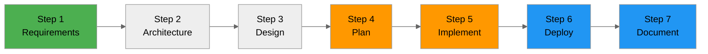

# 🚀 Demo Workflow Guide - Agentic InfraOps for Azure IT Pros

> **Mission**: Deploy Rebel Alliance Tactical Infrastructure using the 7-step AI agent workflow

This guide walks you through using **GitHub Copilot custom agents** to transform requirements into
production-ready Azure infrastructure. Each step leverages specialized AI agents that handle planning,
architecture, implementation, and documentation.

## Prerequisites

Before starting the workflow, ensure you have:

- ✅ **GitHub Copilot** subscription (Individual, Business, or Enterprise)
- ✅ **VS Code** with GitHub Copilot extension installed
- ✅ **Azure Subscription** with contributor permissions
- ✅ **Azure CLI 2.50+** installed and authenticated (`az login`)
- ✅ **Bicep CLI 0.20+** installed (`az bicep install`)
- ✅ **Node.js 18+** and npm for local development (optional)

## Workflow Overview



**Total Time**: ~2-4 hours (depending on project complexity)

---

## How to Use GitHub Copilot Agents

### Accessing Custom Agents

1. **Open Agent Picker**: Press `Ctrl+Alt+I` (Windows/Linux) or `Cmd+Alt+I` (Mac)
2. **Select Agent**: Choose the agent from the list (e.g., "Project Planner", "Bicep Implement")
3. **Provide Context**: Paste the prompt from this guide or reference the requirements file
4. **Review & Approve**: Agents may ask clarifying questions - respond, then approve actions
5. **Wait for Completion**: Agents will create files, run commands, and report results

### Agent Handoffs

Some agents automatically create **handoff buttons** to the next agent in the workflow. When you see:

```
┌────────────────────────────────────┐
│ Handoff to: Azure Principal Architect │
│ Generate WAF assessment            │
└────────────────────────────────────┘
```

Click the button to automatically transition to the next step with context.

---

## Step-by-Step Workflow

### Step 1: Capture Requirements

**Agent**: `Project Planner`  
**Input**: Business requirements (interactive interview)  
**Output**: [`requirements.md`](./requirements.md) (already created for this demo)  
**Time**: 15-30 minutes

#### What This Step Does

The **Project Planner** agent conducts an interactive interview to capture:

- Functional requirements (features, capabilities)
- Non-functional requirements (performance, security, compliance)
- Budget constraints and cost center
- Stakeholder information
- Success criteria

#### For This Demo

✅ **Requirements already prepared!** See [`requirements.md`](./requirements.md)

This file contains pre-filled requirements for the Rebel Alliance Tactical Platform:

- React frontend with 3D Death Star visualization
- Azure Functions API with 3 endpoints (missions, intelligence, reports)
- Static Web App Standard tier deployment
- Application Insights monitoring
- Budget: ~$17/month

**If you want to experience the interview process**, invoke the `Project Planner` agent and ask:

```
I need to create requirements for a new Azure project.
Please interview me to capture functional requirements,
NFRs, budget, and compliance needs.
```

#### Validation

- [ ] `requirements.md` file created
- [ ] All mandatory sections present (Functional, NFR, Budget, Tags)
- [ ] Budget and cost center defined
- [ ] Security requirements documented (demo vs. production)

---

### Step 2: Architecture Assessment

**Agent**: `Azure Principal Architect`  
**Input**: `requirements.md`  
**Output**: `02-architecture-assessment.md`  
**Time**: 20-40 minutes

#### What This Step Does

The **Azure Principal Architect** agent:

- Evaluates requirements against **Azure Well-Architected Framework** (5 pillars)
- Scores each pillar (1-10) with justification
- Recommends Azure services and SKUs
- Generates **cost estimates** using Azure Pricing MCP
- Identifies risks and gaps
- Validates region selection and compliance

#### How to Run

1. **Open Agent Picker**: `Ctrl+Alt+I`
2. **Select**: `Azure Principal Architect`
3. **Paste Prompt**:

```
I need a Well-Architected Framework assessment for this project.

Please analyze the requirements in requirements.md and:
1. Score each WAF pillar (Security, Reliability, Performance, Cost, Operational Excellence) from 1-10
2. Recommend Azure services and SKUs
3. Generate cost estimates using Azure Pricing MCP
4. Identify risks and gaps
5. Validate region selection (westeurope)
6. Document Azure Policy considerations for unauthenticated APIs

Create the assessment in 02-architecture-assessment.md following the standard template.
```

4. **Review Output**: Agent will create `02-architecture-assessment.md`

#### Expected Output

The assessment will include:

- **WAF Scores**:
  - Security: 7/10 (unauthenticated APIs for demo)
  - Reliability: 9/10 (SWA 99.9% SLA)
  - Performance: 10/10 (CDN edge delivery)
  - Cost: 10/10 ($17/month optimized)
  - Operational Excellence: 8/10 (App Insights monitoring)

- **Recommended SKUs**:
  - Static Web App: Standard tier
  - Application Insights: Pay-as-you-go
  - Log Analytics: Pay-as-you-go

- **Cost Breakdown** (via Azure Pricing MCP):
  ```
  Static Web App (Standard):     $9.00/month
  Application Insights:          $5.00/month
  Log Analytics:                 $2.00/month
  Bandwidth (10 GB):             $1.00/month
  ───────────────────────────────────────
  Total:                        $17.00/month
  ```

#### Validation

- [ ] `02-architecture-assessment.md` created
- [ ] WAF pillar scores documented with justification
- [ ] Cost estimates generated (match requirements budget)
- [ ] Azure Policy considerations documented
- [ ] Risks identified (e.g., unauthenticated APIs)

---

### Step 3: Design Artifacts

**Agents**: `Diagram Generator`, `ADR Generator`  
**Input**: `02-architecture-assessment.md`  
**Output**: `03-des-diagram.py`, `03-des-diagram.png`, `03-des-adr-*.md`, `03-des-cost-estimate.md`  
**Time**: 15-30 minutes

#### What This Step Does

Generate visual and decision documentation:

- **Architecture Diagrams** (Python code using `diagrams` library)
- **Architecture Decision Records** (ADRs) for key choices
- **Detailed Cost Estimates** with Azure Pricing MCP

#### 3.1 Generate Architecture Diagram

1. **Open Agent Picker**: `Ctrl+Alt+I`
2. **Select**: `Diagram Generator`
3. **Paste Prompt**:

```
Generate a design architecture diagram for the Rebel Alliance Tactical Platform.

Based on 02-architecture-assessment.md, create:
1. Python script (03-des-diagram.py) using diagrams library
2. Show: Static Web App, Application Insights, Log Analytics
3. Include: Frontend (React), API (Functions), CDN, monitoring flow
4. Use Azure icons and proper relationships

After creating the script, run it to generate 03-des-diagram.png
```

4. **Run the Script**: Agent will execute `python 03-des-diagram.py` to generate PNG

#### 3.2 Create ADRs

1. **Open Agent Picker**: `Ctrl+Alt+I`
2. **Select**: `ADR Generator`
3. **Paste Prompt**:

```
Generate Architecture Decision Records (ADRs) for key design decisions.

Based on requirements.md and 02-architecture-assessment.md, create ADRs for:
1. 03-des-adr-0001-static-web-app-over-app-service.md
   - Decision to use Static Web Apps vs. App Service + Storage
2. 03-des-adr-0002-managed-functions-over-standalone.md
   - Decision to use SWA managed Functions vs. separate Function App
3. 03-des-adr-0003-unauthenticated-api-demo.md
   - Decision to deploy unauthenticated APIs for demo (with production notes)

Follow standard ADR format with WAF pillar impact analysis.
```

#### 3.3 Cost Estimate

1. **Open Agent Picker**: `Ctrl+Alt+I`
2. **Select**: `Azure Principal Architect` (has MCP access)
3. **Paste Prompt**:

```
Generate detailed cost estimate for 03-des-cost-estimate.md

Use Azure Pricing MCP to get exact pricing for:
- Static Web App (Standard tier, westeurope)
- Application Insights (1M requests/month)
- Log Analytics (1 GB/month, 30-day retention)

Include:
- Resource-level breakdown
- Monthly and annual projections
- Comparison with alternative architectures
- Cost optimization recommendations
```

#### Validation

- [ ] `03-des-diagram.py` and `03-des-diagram.png` created
- [ ] 3 ADRs created (0001, 0002, 0003)
- [ ] `03-des-cost-estimate.md` created with MCP pricing data
- [ ] Diagrams render correctly (open PNG to verify)

---

### Step 4: Implementation Plan

**Agent**: `Bicep Plan`  
**Input**: `02-architecture-assessment.md`, `requirements.md`  
**Output**: `04-implementation-plan.md`, `04-governance-constraints.md`  
**Time**: 30-60 minutes

#### What This Step Does

The **Bicep Plan** agent:

- Creates detailed Bicep implementation plan
- Searches **Azure Verified Modules (AVM)** registry for reusable modules
- Defines resource specifications with dependencies
- Discovers **Azure Policy** constraints via governance queries
- Documents deployment sequence and testing strategy
- **DOES NOT WRITE CODE** (planning only)

#### How to Run

1. **Open Agent Picker**: `Ctrl+Alt+I`
2. **Select**: `Bicep Plan`
3. **Paste Prompt**:

```
Create implementation plan for Bicep deployment.

Based on requirements.md and 02-architecture-assessment.md:
1. Search Azure Verified Modules (AVM) registry for:
   - Static Web App module
   - Application Insights module
   - Log Analytics module
2. Define resource specifications with exact parameters
3. Document dependencies (e.g., Log Analytics → App Insights → Static Web App)
4. Check Azure Policy for any governance constraints
5. Create deployment sequence with validation steps
6. Generate 04-implementation-plan.md and 04-governance-constraints.md

Do NOT write Bicep code yet - planning only!
```

#### Expected Output

**04-implementation-plan.md** will include:

- **AVM Module References**:

  ```bicep
  // Log Analytics Workspace
  br/public:avm/res/operational-insights/workspace:0.3.4

  // Application Insights
  br/public:avm/res/insights/component:0.3.1

  // Static Web App
  br/public:avm/res/web/static-site:0.2.2
  ```

- **Resource Specifications**:
  - Log Analytics: Basic tier, 30-day retention
  - App Insights: Workspace-based, linked to Log Analytics
  - Static Web App: Standard SKU, westeurope, managed Functions enabled

- **Deployment Sequence**:
  1. Create Resource Group
  2. Deploy Log Analytics Workspace
  3. Deploy Application Insights (depends on Log Analytics)
  4. Deploy Static Web App (depends on App Insights)

- **Testing Strategy**:
  - Bicep validation (`bicep build`, `bicep lint`)
  - What-If analysis before deployment
  - Post-deployment smoke tests (HTTP 200 checks)

**04-governance-constraints.md** will document:

- Azure Policy query results
- Any policies requiring authentication
- Recommended exemptions for demo deployment

#### Validation

- [ ] `04-implementation-plan.md` created
- [ ] AVM modules identified (not raw Bicep)
- [ ] Dependencies clearly documented
- [ ] `04-governance-constraints.md` created
- [ ] No Bicep code written yet (plan only)

---

### Step 5: Bicep Implementation

**Agent**: `Bicep Implement`  
**Input**: `04-implementation-plan.md`  
**Output**: Bicep templates in `infra/bicep/rebel-tactical/`  
**Time**: 30-90 minutes

#### What This Step Does

The **Bicep Implement** agent:

- Writes production-ready Bicep code based on implementation plan
- Creates modular structure (`main.bicep` + `modules/`)
- Uses **AVM modules** (not raw resource definitions)
- Implements CAF naming conventions
- Adds required tags to all resources
- Creates PowerShell deployment script with what-if support
- Validates Bicep syntax and lints code

#### How to Run

1. **Open Agent Picker**: `Ctrl+Alt+I`
2. **Select**: `Bicep Implement`
3. **Paste Prompt**:

```
Implement Bicep templates for Rebel Alliance Tactical Platform.

Based on 04-implementation-plan.md:
1. Create main.bicep in infra/bicep/rebel-tactical/
   - Parameters: location, environment, projectName, owner, costCenter
   - Variables: CAF naming with region abbreviations, uniqueSuffix
   - Modules: Log Analytics, App Insights, Static Web App
   - Outputs: resource IDs, endpoints, instrumentation key

2. Create modules/:
   - modules/log-analytics.bicep (using AVM)
   - modules/app-insights.bicep (using AVM)
   - modules/static-web-app.bicep (using AVM)

3. Create main.bicepparam with default values

4. Create deploy.ps1 PowerShell script with:
   - [CmdletBinding(SupportsShouldProcess)] for -WhatIf
   - Pre-flight checks (Azure CLI, Bicep, auth)
   - Bicep validation and linting
   - What-If analysis with user confirmation
   - Deployment execution
   - Post-deployment output display

5. Validate all Bicep files (bicep build, bicep lint)

Implement CAF naming: stapp-rebel-tactical-prod-weu
Apply required tags from requirements.md
```

#### Expected Output Structure

```
infra/bicep/rebel-tactical/
├── main.bicep                    # Orchestration
├── main.bicepparam               # Default parameters
├── deploy.ps1                    # Deployment script
└── modules/
    ├── log-analytics.bicep       # AVM wrapper
    ├── app-insights.bicep        # AVM wrapper
    └── static-web-app.bicep      # AVM wrapper
```

#### Key Bicep Patterns

**main.bicep**:

```bicep
param location string = 'westeurope'
param environment string = 'prod'
param projectName string = 'rebel-tactical'

var regionAbbreviations = {
  westeurope: 'weu'
  swedencentral: 'swc'
}
var regionAbbr = regionAbbreviations[location]
var uniqueSuffix = uniqueString(resourceGroup().id)

var tags = {
  Environment: environment
  Project: projectName
  ManagedBy: 'Bicep'
  Owner: owner
  CostCenter: costCenter
  Mission: 'death-star-recon'
}

module logAnalytics 'modules/log-analytics.bicep' = {
  name: 'log-analytics-deployment'
  params: {
    name: 'log-${projectName}-${environment}-${regionAbbr}'
    location: location
    tags: tags
  }
}

module staticWebApp 'modules/static-web-app.bicep' = {
  name: 'static-web-app-deployment'
  params: {
    name: 'stapp-${projectName}-${environment}-${regionAbbr}'
    location: location
    tags: tags
    sku: 'Standard'
    appInsightsConnectionString: appInsights.outputs.connectionString
  }
}
```

**deploy.ps1**:

```powershell
[CmdletBinding(SupportsShouldProcess)]
param(
    [string]$ResourceGroupName = "rg-rebel-tactical-prod-weu",
    [string]$Location = "westeurope"
)

# Pre-flight checks
az --version | Out-Null
bicep --version | Out-Null
az account show | Out-Null

# Validate Bicep
bicep build main.bicep
bicep lint main.bicep

# What-If analysis
if ($PSCmdlet.ShouldProcess($ResourceGroupName, "Deploy infrastructure")) {
    az deployment group create `
        --resource-group $ResourceGroupName `
        --template-file main.bicep `
        --parameters main.bicepparam `
        --what-if

    Read-Host "Press Enter to deploy or Ctrl+C to cancel"

    az deployment group create `
        --resource-group $ResourceGroupName `
        --template-file main.bicep `
        --parameters main.bicepparam
}
```

#### Validation

- [ ] All Bicep files created in `infra/bicep/rebel-tactical/`
- [ ] `bicep build main.bicep` succeeds (no errors)
- [ ] `bicep lint main.bicep` passes (no warnings)
- [ ] AVM modules used (check `br/public:avm/res/` references)
- [ ] CAF naming applied (e.g., `stapp-rebel-tactical-prod-weu`)
- [ ] Required tags present in all resources
- [ ] `deploy.ps1` supports `-WhatIf`

---

### Step 6: Deploy Infrastructure

**Agent**: `Deploy` (or manual execution)  
**Input**: Bicep templates from Step 5  
**Output**: `06-deployment-summary.md`, deployed Azure resources  
**Time**: 5-15 minutes

#### What This Step Does

Execute Bicep deployment to Azure:

- Create resource group
- Run what-if analysis
- Deploy infrastructure
- Capture deployment outputs
- Document resource IDs and endpoints

#### Option A: Using Deploy Agent

1. **Open Agent Picker**: `Ctrl+Alt+I`
2. **Select**: `Deploy`
3. **Paste Prompt**:

```
Deploy Rebel Alliance Tactical Infrastructure to Azure.

1. Verify Azure CLI authentication (az account show)
2. Create resource group: rg-rebel-tactical-prod-weu (westeurope)
3. Run what-if analysis: az deployment group what-if
4. Prompt for confirmation
5. Execute deployment: az deployment group create
6. Capture outputs (resource IDs, endpoints, instrumentation key)
7. Create 06-deployment-summary.md with:
   - Deployment timestamp
   - Resource group and location
   - Deployed resources with IDs
   - Endpoints (Static Web App URL)
   - Next steps for application deployment
```

#### Option B: Manual Deployment

```powershell
# Navigate to Bicep directory
cd infra/bicep/rebel-tactical

# Create resource group
az group create `
    --name rg-rebel-tactical-prod-weu `
    --location westeurope `
    --tags Environment=prod Project=rebel-tactical ManagedBy=Bicep

# Deploy with what-if (preview changes)
./deploy.ps1 -WhatIf

# Deploy for real
./deploy.ps1

# Or use Azure CLI directly
az deployment group create `
    --resource-group rg-rebel-tactical-prod-weu `
    --template-file main.bicep `
    --parameters main.bicepparam
```

#### Expected Output

```
Deployment successful!

Resource Group: rg-rebel-tactical-prod-weu
Location: westeurope

Deployed Resources:
- Log Analytics Workspace: log-rebel-tactical-prod-weu
  ID: /subscriptions/.../log-rebel-tactical-prod-weu

- Application Insights: appi-rebel-tactical-prod-weu
  ID: /subscriptions/.../appi-rebel-tactical-prod-weu
  Instrumentation Key: abc123...

- Static Web App: stapp-rebel-tactical-prod-weu
  ID: /subscriptions/.../stapp-rebel-tactical-prod-weu
  URL: https://stapp-rebel-tactical-prod-weu.azurestaticapps.net

Next Steps:
1. Configure GitHub Actions for Static Web App deployment
2. Push demo-app code to repository
3. Verify frontend and API endpoints
```

#### Validation

- [ ] Resource group created in Azure Portal
- [ ] 3 resources deployed (Log Analytics, App Insights, Static Web App)
- [ ] `06-deployment-summary.md` created
- [ ] Static Web App URL accessible (may show default page)
- [ ] Application Insights receiving telemetry

---

### Step 7: As-Built Documentation

**Agent**: `Workload Documentation Generator`  
**Input**: All previous artifacts + deployed resources  
**Output**: `07-*.md` files (documentation package)  
**Time**: 20-40 minutes

#### What This Step Does

The **Workload Documentation Generator** synthesizes all artifacts into customer-deliverable documentation:

- **07-documentation-index.md**: Master index linking all docs
- **07-design-document.md**: 10-section comprehensive design doc
- **07-operations-runbook.md**: Day-2 operations procedures
- **07-resource-inventory.md**: Complete resource listing
- **07-ab-cost-estimate.md**: As-built cost vs. design variance
- **07-ab-diagram.py/.png**: As-built architecture diagram
- **07-backup-dr-plan.md**: Recovery procedures (optional)

#### How to Run

1. **Open Agent Picker**: `Ctrl+Alt+I`
2. **Select**: `Workload Documentation Generator`
3. **Paste Prompt**:

```
Generate complete as-built documentation for Rebel Alliance Tactical Platform.

Synthesize all artifacts from Steps 1-6:
- requirements.md
- 02-architecture-assessment.md
- 03-des-* artifacts
- 04-implementation-plan.md
- Deployed Bicep templates (infra/bicep/rebel-tactical/)
- 06-deployment-summary.md

Create the following documents:
1. 07-documentation-index.md (master index with links)
2. 07-design-document.md (10-section design doc)
3. 07-operations-runbook.md (health checks, maintenance, incident response)
4. 07-resource-inventory.md (extract from Bicep, list all resources with SKUs)
5. 07-ab-cost-estimate.md (use Azure Pricing MCP for actual deployed costs)
6. 07-ab-diagram.py (as-built architecture, run to generate PNG)
7. 07-backup-dr-plan.md (recovery procedures, RTO/RPO)

Include variance analysis in cost estimate (design vs. as-built).
```

#### Expected Documentation

**07-documentation-index.md** (example):

```markdown
# Rebel Alliance Tactical Platform - Documentation Index

## Design Phase

- [Requirements](../requirements.md)
- [Architecture Assessment](02-architecture-assessment.md)
- [Design Diagram](03-des-diagram.png)
- [Cost Estimate](03-des-cost-estimate.md)

## Implementation Phase

- [Implementation Plan](04-implementation-plan.md)
- [Deployment Summary](06-deployment-summary.md)

## As-Built Documentation

- [Design Document](07-design-document.md) ⭐ START HERE
- [Operations Runbook](07-operations-runbook.md)
- [Resource Inventory](07-resource-inventory.md)
- [As-Built Diagram](07-ab-diagram.png)
- [As-Built Cost Estimate](07-ab-cost-estimate.md)
- [Backup & DR Plan](07-backup-dr-plan.md)
```

**07-ab-cost-estimate.md** will compare:

```
Design Estimate:    $17.00/month
As-Built Actual:    $17.00/month
Variance:           $0.00 (0%)
```

#### Validation

- [ ] 7 documentation files created
- [ ] `07-documentation-index.md` links work
- [ ] `07-design-document.md` has 10 sections (Executive Summary → Appendices)
- [ ] `07-operations-runbook.md` includes health checks, incident response
- [ ] `07-resource-inventory.md` matches deployed resources
- [ ] `07-ab-cost-estimate.md` has variance analysis
- [ ] `07-ab-diagram.png` generated and matches deployed architecture

---

## Post-Deployment: Application Deployment

After infrastructure is deployed (Step 6), deploy the application code:

### Using GitHub Actions (Recommended)

1. **Get Deployment Token**:

   ```bash
   az staticwebapp secrets list \
       --name stapp-rebel-tactical-prod-weu \
       --resource-group rg-rebel-tactical-prod-weu \
       --query "properties.apiKey" -o tsv
   ```

2. **Add GitHub Secret**:
   - Go to GitHub repo → Settings → Secrets → Actions
   - Create secret: `AZURE_STATIC_WEB_APPS_API_TOKEN`
   - Paste the deployment token

3. **Create Workflow** (`.github/workflows/azure-static-web-apps.yml`):

   ```yaml
   name: Deploy Rebel Tactical Platform

   on:
     push:
       branches: [main]
     pull_request:
       types: [opened, synchronize, reopened, closed]
       branches: [main]

   jobs:
     build_and_deploy:
       runs-on: ubuntu-latest
       steps:
         - uses: actions/checkout@v3

         - name: Build And Deploy
           uses: Azure/static-web-apps-deploy@v1
           with:
             azure_static_web_apps_api_token: ${{ secrets.AZURE_STATIC_WEB_APPS_API_TOKEN }}
             repo_token: ${{ secrets.GITHUB_TOKEN }}
             action: "upload"
             app_location: "/demo-app"
             api_location: "/api"
             output_location: "dist"
   ```

4. **Push to GitHub**:

   ```bash
   git add .
   git commit -m "feat: Deploy Rebel Alliance Tactical Platform"
   git push origin main
   ```

5. **Monitor Deployment**:
   - GitHub Actions tab will show deployment progress
   - After 3-5 minutes, visit Static Web App URL
   - Verify 3D Death Star loads and API returns data

### Manual Deployment

```bash
# Install Static Web Apps CLI
npm install -g @azure/static-web-apps-cli

# Build frontend
cd demo-app
npm install
npm run build

# Deploy
swa deploy \
    --app-location demo-app \
    --api-location api \
    --deployment-token <your-token>
```

---

## Verification Checklist

After completing all 7 steps:

### Infrastructure Verification

- [ ] Resource group exists in Azure Portal
- [ ] Log Analytics Workspace deployed
- [ ] Application Insights deployed and linked to Log Analytics
- [ ] Static Web App deployed (Standard tier)
- [ ] All resources have required tags

### Application Verification

- [ ] Static Web App URL is accessible (HTTPS)
- [ ] Frontend loads without errors (check browser console)
- [ ] 3D Death Star renders correctly
- [ ] Mission Dashboard displays data
- [ ] Intelligence Feed shows reports
- [ ] API endpoints return valid JSON:
  - `/api/missions` → HTTP 200, array of missions
  - `/api/intelligence` → HTTP 200, array of intelligence
  - `/api/reports` → HTTP 201 (POST test)

### Monitoring Verification

- [ ] Application Insights receiving frontend telemetry
- [ ] Application Insights receiving API telemetry
- [ ] Log Analytics collecting logs
- [ ] No errors in Application Insights Failures blade

### Documentation Verification

- [ ] 7-step workflow completed (all files created)
- [ ] `07-documentation-index.md` links all artifacts
- [ ] Bicep templates validated and deployed
- [ ] Cost matches budget (±10% tolerance)

---

## Troubleshooting

### Agent Not Responding

**Problem**: Agent stuck or not producing output

**Solutions**:

- Check VS Code output panel for errors
- Restart Copilot agent: Close chat, reopen with `Ctrl+Alt+I`
- Ensure GitHub Copilot extension is up to date
- Try a simpler prompt with less context

### Bicep Deployment Fails

**Problem**: `az deployment group create` returns errors

**Solutions**:

- Check Azure CLI authentication: `az account show`
- Verify Bicep syntax: `bicep build main.bicep`
- Review error message for policy violations
- Check resource name availability (must be globally unique)
- Validate SKU availability in target region

### Static Web App Not Loading

**Problem**: URL returns 404 or default page

**Solutions**:

- Check GitHub Actions workflow completed successfully
- Verify deployment token is correct
- Ensure `app_location` points to `demo-app` (not root)
- Check `staticwebapp.config.json` is present
- Wait 5 minutes for initial deployment propagation

### API Returns Errors

**Problem**: `/api/missions` returns 500 or timeout

**Solutions**:

- Check Functions are deployed: Azure Portal → Static Web App → Functions
- Verify `api/` folder structure (GetMissions/function.json exists)
- Check `allowedRoles: ["anonymous"]` in staticwebapp.config.json
- Review Application Insights for Function errors
- Confirm Node.js runtime version (18+)

### Cost Exceeds Budget

**Problem**: Azure costs higher than $20/month

**Solutions**:

- Check Application Insights sampling (should be 20 items/sec)
- Review Log Analytics data ingestion (should be <1 GB/month)
- Verify no unexpected resources deployed
- Set up budget alert in Azure Portal at $16/month
- Consider reducing telemetry sampling rate

---

## Additional Resources

### Documentation

- [Azure Static Web Apps Docs](https://learn.microsoft.com/en-us/azure/static-web-apps/)
- [Azure Functions with Static Web Apps](https://learn.microsoft.com/en-us/azure/static-web-apps/apis-functions)
- [Azure Verified Modules Registry](https://aka.ms/avm)
- [Well-Architected Framework](https://learn.microsoft.com/en-us/azure/well-architected/)

### GitHub Copilot

- [Custom Agents Documentation](https://docs.github.com/en/copilot/using-github-copilot/using-extensions-to-integrate-external-tools-with-copilot-chat)
- [Agent Development Guide](https://github.com/github/copilot-docs)

### Azure Pricing

- [Static Web Apps Pricing](https://azure.microsoft.com/en-us/pricing/details/app-service/static/)
- [Application Insights Pricing](https://azure.microsoft.com/en-us/pricing/details/monitor/)
- [Azure Pricing Calculator](https://azure.microsoft.com/en-us/pricing/calculator/)

---

## Summary

This workflow demonstrates **Infrastructure as Code engineered by AI agents**:

1. ✅ **Requirements** captured interactively by `Project Planner`
2. ✅ **Architecture** assessed by `Azure Principal Architect` using WAF
3. ✅ **Design** visualized by `Diagram Generator` and documented by `ADR Generator`
4. ✅ **Implementation Plan** created by `Bicep Plan` using AVM modules
5. ✅ **Bicep Code** generated by `Bicep Implement` with CAF naming
6. ✅ **Deployment** executed with what-if analysis and validation
7. ✅ **Documentation** synthesized by `Workload Documentation Generator`

**Result**: Production-ready Azure infrastructure, fully documented, deployed in 2-4 hours.

---

**May the Force be with your deployments!** 🌟

_For questions or issues, contact: `rebel-engineering@example.com`_
