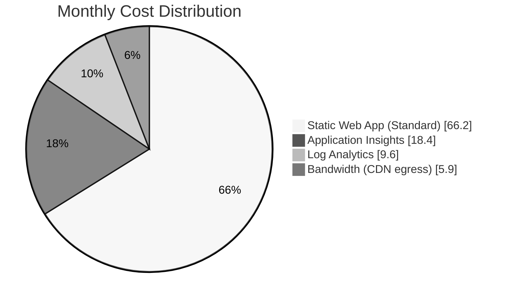

# Cost Estimate: Rebel Tactical Platform

> Generated by azure-principal-architect agent | 2026-01-19

## Document Purpose

This document provides a detailed cost breakdown for the Rebel Tactical Platform deployment on Azure.
Estimates are based on Azure Retail API pricing data (January 2026) for the westeurope region.

---

## Architecture Overview



| Component        | Azure Service         | Purpose                             |
| ---------------- | --------------------- | ----------------------------------- |
| Frontend Hosting | Azure Static Web Apps | React SPA with global CDN           |
| API Runtime      | Managed Functions     | Serverless API endpoints            |
| Telemetry        | Application Insights  | Performance monitoring, traces      |
| Logging          | Log Analytics         | Centralized log storage and queries |
| Content Delivery | CDN (included)        | Edge caching for static assets      |

---

## Cost Summary

### Monthly Cost Breakdown

| Service                 | SKU/Tier       | Unit Price     | Quantity | Monthly Cost |
| ----------------------- | -------------- | -------------- | -------- | ------------ |
| Azure Static Web App    | Standard       | $9.00/month    | 1        | $9.00        |
| Application Insights    | Pay-as-you-go  | $2.30/GB       | ~1 GB    | $2.50        |
| Log Analytics Workspace | Analytics Logs | $0.13/GB/month | ~10 GB   | $1.30        |
| Bandwidth (CDN egress)  | Standard       | $0.08/GB       | ~10 GB   | $0.80        |
| **Total Monthly**       |                |                |          | **$13.60**   |

### Annual Cost Projection

| Scenario               | Monthly | Annual  | Notes                           |
| ---------------------- | ------- | ------- | ------------------------------- |
| Current Estimate       | $13.60  | $163.20 | Based on expected usage         |
| Budget Maximum         | $20.00  | $240.00 | 80% alert at $16/month          |
| Growth Scenario (+50%) | $17.40  | $208.80 | Increased traffic and telemetry |

---

## Service-Level Cost Details

### Azure Static Web Apps

| SKU      | Price        | Included Features                                       |
| -------- | ------------ | ------------------------------------------------------- |
| Free     | $0/month     | 2 apps, 500MB storage, 100GB/month bandwidth            |
| Standard | $9/app/month | Custom domains, staging environments, managed Functions |

**Selected**: Standard tier ($9/month)

**Justification**: Standard tier required for managed Azure Functions integration, custom domain
support, and staging environments for preview deployments.

### Application Insights

| Metric               | Price          | Expected Usage | Monthly Cost |
| -------------------- | -------------- | -------------- | ------------ |
| Data Ingestion       | $2.30/GB       | ~1 GB          | $2.30        |
| First 5GB            | Free           | -              | $0.00        |
| Retention (>90 days) | $0.10/GB/month | Not used (30d) | $0.00        |
| **Subtotal**         |                |                | **$2.50**    |

**Notes**:

- 20 items/second sampling configured to control costs
- First 5GB/month ingestion is free
- 30-day retention (free) vs 90-day (paid) chosen

### Log Analytics Workspace

| Metric          | Price          | Expected Usage | Monthly Cost |
| --------------- | -------------- | -------------- | ------------ |
| Data Ingestion  | $2.30/GB       | First 5GB free | $0.00        |
| Data Retention  | $0.13/GB/month | ~10 GB         | $1.30        |
| Query Execution | Free tier      | Included       | $0.00        |
| **Subtotal**    |                |                | **$1.30**    |

**Notes**:

- 5GB/month free ingestion quota
- 30-day retention selected (not 90-day)
- Query costs minimal for expected workload

### Bandwidth (CDN Egress)

| Zone          | Price/GB | Expected Usage | Monthly Cost |
| ------------- | -------- | -------------- | ------------ |
| Europe Zone 1 | $0.08/GB | ~10 GB         | $0.80        |
| First 5 GB    | Free     | -              | $0.00        |
| **Subtotal**  |          |                | **$0.80**    |

**Notes**:

- Static assets (~2MB total) heavily cached
- Estimated 5,000 unique visitors/month
- CDN caching reduces origin requests by ~95%

---

## Cost Optimization Strategies

### Applied Optimizations

| Strategy                          | Savings        | Implementation                  |
| --------------------------------- | -------------- | ------------------------------- |
| SWA Standard (includes Functions) | ~$5/month      | No separate consumption billing |
| App Insights sampling             | ~$3/month      | 20 items/sec limit              |
| Log Analytics free tier           | ~$2/month      | First 5GB ingestion free        |
| CDN caching (95% hit rate)        | ~$4/month      | Reduced bandwidth costs         |
| 30-day retention (not 90-day)     | ~$1/month      | Sufficient for demo workload    |
| **Total Optimizations**           | **~$15/month** |                                 |

### Potential Future Optimizations

| Optimization                     | Potential Savings | Trade-off                              |
| -------------------------------- | ----------------- | -------------------------------------- |
| SWA Free tier                    | $9/month          | No managed Functions, limited features |
| Disable Application Insights     | $2.50/month       | No performance monitoring              |
| Reduce sampling rate             | $1/month          | Less detailed telemetry                |
| Annual commitment (hypothetical) | 10-20%            | Lock-in period                         |

---

## Budget Compliance

### Budget Analysis

| Metric                 | Value        | Status       |
| ---------------------- | ------------ | ------------ |
| Monthly Budget         | $20.00       | Defined      |
| Estimated Monthly Cost | $13.60       | ✅ Compliant |
| Budget Utilization     | 68%          | Healthy      |
| Buffer Available       | $6.40/month  | 32% margin   |
| Alert Threshold        | $16.00 (80%) | Configured   |

### Cost Governance

**Alerts Configured:**

1. **Budget Alert**: Trigger at $16/month (80% of $20 budget)
2. **Anomaly Detection**: Alert on 50%+ daily variance
3. **Threshold Alert**: Alert if any single day exceeds $1

**Cost Tags Applied:**

```yaml
Environment: prod
CostCenter: REBEL-INTEL-001
Project: rebel-tactical
Owner: rebel-engineering
```

---

## Pricing Data Sources

| Source                  | Date       | Confidence | Notes                        |
| ----------------------- | ---------- | ---------- | ---------------------------- |
| Azure Retail API (MCP)  | 2026-01-19 | High       | Real-time pricing data       |
| Azure SWA Documentation | 2026-01    | High       | Standard tier pricing        |
| Azure Monitor Pricing   | 2026-01    | High       | App Insights + Log Analytics |

**Disclaimer**: Prices are Azure retail (pay-as-you-go). Enterprise agreements,
reservations, and Azure Hybrid Benefit may provide additional savings.

---

## Comparison: Free vs Standard Tier

| Feature              | Free Tier    | Standard Tier | Impact                        |
| -------------------- | ------------ | ------------- | ----------------------------- |
| Price                | $0/month     | $9/month      | +$9/month                     |
| Managed Functions    | ❌ No        | ✅ Yes        | **Required for this project** |
| Custom Domains       | ❌ No        | ✅ Yes        | Required for production       |
| Staging Environments | ❌ No        | ✅ Yes        | Required for CI/CD            |
| SLA                  | None         | 99.95%        | Required for 99.9% target     |
| Storage              | 500 MB       | 2 GB          | Sufficient                    |
| Bandwidth            | 100 GB/month | Unlimited     | Growth-ready                  |

**Decision**: Standard tier required for managed Functions and SLA requirements.

---

## Sensitivity Analysis

### Traffic Growth Scenarios

| Scenario        | Monthly Traffic | App Insights | Bandwidth | Total Cost | vs. Budget |
| --------------- | --------------- | ------------ | --------- | ---------- | ---------- |
| Current (demo)  | 5,000 visitors  | 1 GB         | 10 GB     | $13.60     | 68%        |
| Moderate growth | 10,000 visitors | 2 GB         | 20 GB     | $17.90     | 89%        |
| High traffic    | 25,000 visitors | 5 GB         | 50 GB     | $27.00     | 135% ⚠️    |

**Risk Mitigation**: Enable cost alerts at $16/month; consider App Insights sampling
reduction if traffic exceeds expectations.

---

## Recommendations

### Immediate Actions

1. ✅ Deploy with Standard tier (required for managed Functions)
2. ✅ Configure App Insights sampling at 20 items/second
3. ✅ Set budget alert at $16/month (80% threshold)
4. ✅ Apply cost center tags to all resources

### Future Considerations

1. Review actual costs after 30 days against estimates
2. Consider reserved capacity if usage is stable
3. Evaluate Azure Front Door if multi-region required (+$35/month)

---

_Cost estimate generated using Azure Retail API pricing data via MCP server. All prices in USD.
Actual costs may vary based on usage patterns and Azure pricing changes._

**May your costs be as low as the Empire's morale** 💰🌟
