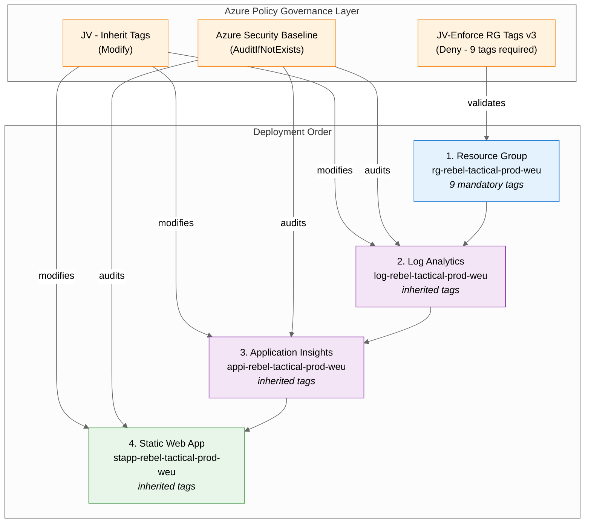

# Step 4: Bicep Implementation Plan - Rebel Tactical Platform

> Generated by bicep-plan agent | 2026-01-19 (v2 - with governance constraints)

## Overview

This implementation plan provides a detailed, machine-readable specification for deploying the
Rebel Tactical Platform infrastructure using Azure Bicep. The plan references the architecture
diagram from Step 3 ([03-des-diagram.png](./03-des-diagram.png)) for resource dependencies and
data flow visualization.

**Key Implementation Decisions:**

- Use Azure Verified Modules (AVM) for all resources
- Single deployment template with modular structure
- Region: `westeurope` (GDPR compliance)
- Estimated monthly cost: **$13.60** (68% of $20 budget)
- **Governance compliance with 9 mandatory tags on Resource Group**

---

## Governance Alignment

This plan complies with governance constraints discovered in
[`04-governance-constraints.md`](./04-governance-constraints.md) and
[`04-governance-constraints.json`](./04-governance-constraints.json).

### Critical Policy Compliance

| Policy                                | Effect   | Compliance Action                              |
| ------------------------------------- | -------- | ---------------------------------------------- |
| **JV-Enforce Resource Group Tags v3** | **Deny** | All 9 mandatory tags included in RG deployment |
| JV - Inherit Multiple Tags from RG    | Modify   | Tags auto-inherited by child resources         |
| Azure Security Baseline               | Audit    | TLS 1.2+, workspace-based App Insights         |
| Block Classic Resources               | Deny     | ARM resources only (compliant)                 |
| GDPR 2016/679                         | Audit    | Data flows documented in architecture          |
| PCI DSS v4                            | Audit    | No payment data processed                      |

### 9 Mandatory Tags (DENY Policy Enforcement)

The Resource Group deployment **WILL FAIL** without these tags:

```bicep
tags: {
  environment: 'prod'
  owner: 'rebel-alliance-ops'
  costcenter: 'rebel-ops-001'
  application: 'rebel-tactical-platform'
  workload: 'web-app'
  sla: 'standard'
  'backup-policy': 'none'
  'maint-window': 'sunday-02:00-06:00'
  'technical-contact': 'rebel-devops@alliance.io'
}
```

> ⚠️ **Note**: Child resources will inherit these tags via the "JV - Inherit Multiple Tags from
> Resource Group" Modify policy. Explicit tag assignment on child resources is recommended for
> clarity.

---

## Resource Inventory

| #   | Resource Type           | Name Pattern                    | AVM Module                               | Version  |
| --- | ----------------------- | ------------------------------- | ---------------------------------------- | -------- |
| 1   | Resource Group          | `rg-rebel-tactical-prod-weu`    | `avm/res/resources/resource-group`       | `0.4.3`  |
| 2   | Log Analytics Workspace | `log-rebel-tactical-prod-weu`   | `avm/res/operational-insights/workspace` | `0.15.0` |
| 3   | Application Insights    | `appi-rebel-tactical-prod-weu`  | `avm/res/insights/component`             | `0.7.1`  |
| 4   | Static Web App          | `stapp-rebel-tactical-prod-weu` | `avm/res/web/static-site`                | `0.9.3`  |

**Total Resources**: 4

---

## Resource Dependency Diagram



**Deployment Order Rationale:**

1. **Resource Group** - Foundation container; requires 9 mandatory tags to pass policy
2. **Log Analytics Workspace** - Required by Application Insights; inherits tags from RG
3. **Application Insights** - Depends on Log Analytics for workspace-based mode
4. **Static Web App** - Consumes App Insights instrumentation key

---

## Module Structure

```
infra/bicep/rebel-tactical/
├── main.bicep                    # Orchestrator - deploys all modules
├── main.bicepparam               # Parameter file for production
├── modules/
│   ├── log-analytics.bicep       # Log Analytics Workspace
│   ├── app-insights.bicep        # Application Insights
│   └── static-web-app.bicep      # Azure Static Web App
└── README.md                     # Deployment instructions
```

---

## Resources

### Resource Group

```yaml
name: resourceGroup
kind: AVM
avmModule: br/public:avm/res/resources/resource-group:0.4.3

purpose: Container for all Rebel Tactical Platform resources
dependsOn: []

parameters:
  required:
    - name: name
      type: string
      description: Resource group name following CAF pattern
      example: rg-rebel-tactical-prod-weu
    - name: location
      type: string
      description: Azure region for resource deployment
      example: westeurope
    - name: tags
      type: object
      description: "MANDATORY: 9 required tags per JV-Enforce RG Tags v3 policy"
      governance: "Required by policy: JV-Enforce Resource Group Tags v3 (Deny effect)"
      example:
        environment: prod
        owner: rebel-alliance-ops
        costcenter: rebel-ops-001
        application: rebel-tactical-platform
        workload: web-app
        sla: standard
        backup-policy: none
        maint-window: sunday-02:00-06:00
        technical-contact: rebel-devops@alliance.io

outputs:
  - name: resourceId
    type: string
    description: Resource ID of the created resource group
  - name: name
    type: string
    description: Name of the resource group
  - name: location
    type: string
    description: Location of the resource group

estimatedCost:
  sku: N/A
  monthlyRange: "$0"
  costDrivers: [No direct cost - management plane only]

references:
  docs: https://learn.microsoft.com/azure/azure-resource-manager/management/manage-resource-groups-portal
  avm: https://github.com/Azure/bicep-registry-modules/tree/avm/res/resources/resource-group/0.4.3
```

---

### Log Analytics Workspace

```yaml
name: logAnalyticsWorkspace
kind: AVM
avmModule: br/public:avm/res/operational-insights/workspace:0.15.0

purpose: Centralized log storage for Application Insights and diagnostic data
dependsOn: [resourceGroup]

parameters:
  required:
    - name: name
      type: string
      description: Workspace name following CAF pattern
      example: log-rebel-tactical-prod-weu
    - name: location
      type: string
      description: Azure region
      example: westeurope

  optional:
    - name: skuName
      type: string
      description: Pricing tier
      default: PerGB2018
    - name: dataRetention
      type: int
      description: Data retention in days
      default: 30
    - name: dailyQuotaGb
      type: int
      description: Daily data cap in GB (-1 = unlimited)
      default: 1
    - name: tags
      type: object
      description: "Resource tags (inherited from RG via Modify policy)"
      governance: "Auto-inherited via: JV - Inherit Multiple Tags from Resource Group"

outputs:
  - name: resourceId
    type: string
    description: Resource ID of the Log Analytics Workspace
  - name: name
    type: string
    description: Name of the workspace
  - name: workspaceId
    type: string
    description: Workspace ID (GUID) for linking

estimatedCost:
  sku: PerGB2018
  monthlyRange: "$0 - $2.30"
  costDrivers:
    - Data ingestion after 5GB free tier ($2.30/GB)
    - Data retention after 31 days ($0.13/GB/month)
    - Expected: ~10GB/month ≈ $1.30

references:
  docs: https://learn.microsoft.com/azure/azure-monitor/logs/log-analytics-workspace-overview
  avm: https://github.com/Azure/bicep-registry-modules/tree/avm/res/operational-insights/workspace/0.15.0
```

---

### Application Insights

```yaml
name: applicationInsights
kind: AVM
avmModule: br/public:avm/res/insights/component:0.7.1

purpose: Application performance monitoring for frontend and API telemetry
dependsOn: [logAnalyticsWorkspace]

parameters:
  required:
    - name: name
      type: string
      description: Application Insights name following CAF pattern
      example: appi-rebel-tactical-prod-weu
    - name: location
      type: string
      description: Azure region
      example: westeurope
    - name: workspaceResourceId
      type: string
      description: Resource ID of the linked Log Analytics Workspace
      governance: "Best practice per Azure Security Baseline"
      example: /subscriptions/.../providers/Microsoft.OperationalInsights/workspaces/log-rebel-tactical-prod-weu

  optional:
    - name: applicationType
      type: string
      description: Application type
      default: web
    - name: kind
      type: string
      description: Kind of application
      default: web
    - name: retentionInDays
      type: int
      description: Data retention period
      default: 30
    - name: samplingPercentage
      type: int
      description: Telemetry sampling percentage (100 = no sampling)
      default: 100
    - name: disableIpMasking
      type: bool
      description: Disable IP address masking
      default: false
    - name: tags
      type: object
      description: "Resource tags (inherited from RG via Modify policy)"
      governance: "Auto-inherited via: JV - Inherit Multiple Tags from Resource Group"

outputs:
  - name: resourceId
    type: string
    description: Resource ID of Application Insights
  - name: name
    type: string
    description: Name of the Application Insights instance
  - name: instrumentationKey
    type: string
    description: Instrumentation key for telemetry SDK
  - name: connectionString
    type: string
    description: Connection string for modern SDK configuration

estimatedCost:
  sku: Pay-as-you-go
  monthlyRange: "$0 - $5.00"
  costDrivers:
    - Data ingestion after 5GB free ($2.30/GB)
    - Basic log retention ($0.10/GB/month after 90 days)
    - Expected: ~1GB/month ≈ $2.50

references:
  docs: https://learn.microsoft.com/azure/azure-monitor/app/app-insights-overview
  avm: https://github.com/Azure/bicep-registry-modules/tree/avm/res/insights/component/0.7.1
```

---

### Static Web App

```yaml
name: staticWebApp
kind: AVM
avmModule: br/public:avm/res/web/static-site:0.9.3

purpose: Host React frontend with managed Azure Functions API runtime
dependsOn: [applicationInsights]

parameters:
  required:
    - name: name
      type: string
      description: Static Web App name following CAF pattern
      example: stapp-rebel-tactical-prod-weu
    - name: location
      type: string
      description: Azure region (Static Web Apps has limited regions)
      example: westeurope

  optional:
    - name: sku
      type: string
      description: Pricing tier (Free or Standard)
      default: Standard
      governance: "Standard required for managed Functions"
    - name: repositoryUrl
      type: string
      description: GitHub repository URL for deployment
      default: https://github.com/jonathan-vella/rebel-ops
    - name: repositoryBranch
      type: string
      description: Branch to deploy from
      default: main
    - name: appLocation
      type: string
      description: Location of app code in repository
      default: demo-app
    - name: apiLocation
      type: string
      description: Location of API code in repository
      default: api
    - name: outputLocation
      type: string
      description: Build output location
      default: dist
    - name: appSettings
      type: object
      description: Application settings including App Insights connection
      example:
        APPLICATIONINSIGHTS_CONNECTION_STRING: "@Microsoft.AppConfiguration(endpoint=...)"
    - name: allowedIpRanges
      type: array
      description: IP ranges allowed to access the app (empty = all)
      default: []
    - name: stagingEnvironmentPolicy
      type: string
      description: Policy for staging environments
      default: Enabled
    - name: enterpriseGradeCdnStatus
      type: string
      description: Enable enterprise-grade CDN
      default: Disabled
    - name: tags
      type: object
      description: "Resource tags (inherited from RG via Modify policy)"
      governance: "Auto-inherited via: JV - Inherit Multiple Tags from Resource Group"

outputs:
  - name: resourceId
    type: string
    description: Resource ID of the Static Web App
  - name: name
    type: string
    description: Name of the Static Web App
  - name: defaultHostname
    type: string
    description: Default hostname (*.azurestaticapps.net)
  - name: apiKey
    type: string
    description: Deployment token for CI/CD

estimatedCost:
  sku: Standard
  monthlyRange: "$9.00"
  costDrivers:
    - Fixed monthly price for Standard tier
    - Includes managed Functions runtime (no additional cost)
    - Unlimited bandwidth (included)
    - 2 custom domains included

references:
  docs: https://learn.microsoft.com/azure/static-web-apps/overview
  avm: https://github.com/Azure/bicep-registry-modules/tree/avm/res/web/static-site/0.9.3
```

---

## Monthly Cost Breakdown

| Resource                | SKU/Tier      | Unit Price     | Expected Usage | Monthly Cost |
| ----------------------- | ------------- | -------------- | -------------- | ------------ |
| Resource Group          | N/A           | $0             | 1              | $0.00        |
| Log Analytics Workspace | PerGB2018     | $0.13/GB/month | ~10 GB         | $1.30        |
| Application Insights    | Pay-as-you-go | $2.30/GB       | ~1 GB          | $2.50        |
| Azure Static Web App    | Standard      | $9.00/month    | 1              | $9.00        |
| Bandwidth (CDN egress)  | Standard      | $0.08/GB       | ~10 GB         | $0.80        |
| **Total Estimated**     |               |                |                | **$13.60**   |

**Budget Compliance:**

- Budget: $20/month
- Estimated: $13.60/month
- Buffer: $6.40/month (32% contingency) ✅

---

## Implementation Tasks

### Phase 1 — Governance Pre-Flight Validation

**Objective:** Verify Azure Policy constraints before deployment

**IMPLEMENT-GOAL-001**: Validate governance constraints and tag requirements

| Task     | Description                        | Action                                          |
| -------- | ---------------------------------- | ----------------------------------------------- |
| TASK-001 | Read governance constraints        | Reference `04-governance-constraints.json`      |
| TASK-002 | Verify 9 mandatory tags defined    | Check policy compliance before RG creation      |
| TASK-003 | Validate naming pattern exclusions | Ensure RG name doesn't match exclusion patterns |
| TASK-004 | Document policy compliance         | Add governance notes to README.md               |

---

### Phase 2 — Foundation Infrastructure

**Objective:** Create resource group with mandatory governance tags

**IMPLEMENT-GOAL-002**: Deploy resource group with 9 mandatory tags (policy compliance)

| Task     | Description                              | Action                                        |
| -------- | ---------------------------------------- | --------------------------------------------- |
| TASK-005 | Define mandatory tags variable           | `var mandatoryTags = { ... }` (all 9 tags)    |
| TASK-006 | Create resource group in main.bicep      | `targetScope = 'subscription'`                |
| TASK-007 | Apply 9 mandatory tags to resource group | Required for JV-Enforce RG Tags v3 policy     |
| TASK-008 | Validate resource group creation         | `az group show -n rg-rebel-tactical-prod-weu` |
| TASK-009 | Verify tag compliance                    | `az policy state list --resource-group ...`   |

**Critical Configuration:**

```bicep
// main.bicep - Mandatory governance tags
var mandatoryTags = {
  environment: environment        // Parameter: 'prod', 'dev', 'staging'
  owner: 'rebel-alliance-ops'
  costcenter: 'rebel-ops-001'
  application: 'rebel-tactical-platform'
  workload: 'web-app'
  sla: 'standard'
  'backup-policy': 'none'
  'maint-window': 'sunday-02:00-06:00'
  'technical-contact': 'rebel-devops@alliance.io'
}
```

---

### Phase 3 — Observability Stack

**Objective:** Deploy Log Analytics and Application Insights for monitoring

**IMPLEMENT-GOAL-003**: Deploy workspace-based Application Insights (Security Baseline compliance)

| Task     | Description                        | Action                                                 |
| -------- | ---------------------------------- | ------------------------------------------------------ |
| TASK-010 | Create Log Analytics module        | `modules/log-analytics.bicep`                          |
| TASK-011 | Configure 30-day retention         | `dataRetention: 30`                                    |
| TASK-012 | Set daily quota to 1GB             | `dailyQuotaGb: 1`                                      |
| TASK-013 | Pass mandatory tags to module      | Tags inherited, but explicit for clarity               |
| TASK-014 | Create Application Insights module | `modules/app-insights.bicep`                           |
| TASK-015 | Link to Log Analytics workspace    | `workspaceResourceId: logAnalytics.outputs.resourceId` |
| TASK-016 | Configure web application type     | `applicationType: 'web'`                               |
| TASK-017 | Output instrumentation key         | For injection into Static Web App                      |

---

### Phase 4 — Static Web App Deployment

**Objective:** Deploy Static Web App with managed Functions

**IMPLEMENT-GOAL-004**: Deploy Static Web App Standard tier

| Task     | Description                           | Action                                          |
| -------- | ------------------------------------- | ----------------------------------------------- |
| TASK-018 | Create Static Web App module          | `modules/static-web-app.bicep`                  |
| TASK-019 | Configure Standard SKU                | `sku: 'Standard'`                               |
| TASK-020 | Link GitHub repository                | `repositoryUrl`, `repositoryBranch`             |
| TASK-021 | Configure app and API locations       | `appLocation: 'demo-app'`, `apiLocation: 'api'` |
| TASK-022 | Inject App Insights connection string | `appSettings` with connection string            |
| TASK-023 | Enable staging environments           | `stagingEnvironmentPolicy: 'Enabled'`           |
| TASK-024 | Output deployment token               | For GitHub Actions workflow                     |

---

### Phase 5 — Main Orchestrator

**Objective:** Create main.bicep to orchestrate all module deployments

**IMPLEMENT-GOAL-005**: Create main orchestrator template with governance compliance

| Task     | Description                    | Action                                       |
| -------- | ------------------------------ | -------------------------------------------- |
| TASK-025 | Create main.bicep              | Subscription-scoped deployment               |
| TASK-026 | Define mandatory tags variable | Centralized governance configuration         |
| TASK-027 | Define parameters              | Environment, project name, location          |
| TASK-028 | Create resource group inline   | Using AVM module with mandatory tags         |
| TASK-029 | Deploy observability stack     | Log Analytics → App Insights                 |
| TASK-030 | Deploy Static Web App          | With App Insights dependency                 |
| TASK-031 | Define outputs                 | Hostname, App Insights key, deployment token |

---

### Phase 6 — Parameters and Validation

**Objective:** Create parameter files and validate deployment

**IMPLEMENT-GOAL-006**: Create production parameter file and validate

| Task     | Description                         | Action                                        |
| -------- | ----------------------------------- | --------------------------------------------- |
| TASK-032 | Create main.bicepparam              | Production parameter values                   |
| TASK-033 | Validate Bicep syntax               | `bicep build main.bicep`                      |
| TASK-034 | Run Bicep linter                    | `bicep lint main.bicep`                       |
| TASK-035 | Perform what-if analysis            | `az deployment sub what-if`                   |
| TASK-036 | Verify policy compliance in what-if | Check for policy violations before deploy     |
| TASK-037 | Create README.md                    | Deployment instructions with governance notes |

---

## Required Tags (Policy-Enforced)

All resource groups must include these 9 tags per `JV-Enforce Resource Group Tags v3` policy:

```bicep
// Mandatory tags - deployment will FAIL without these
var mandatoryTags = {
  // Required by policy: JV-Enforce Resource Group Tags v3
  environment: 'prod'                         // dev, staging, prod
  owner: 'rebel-alliance-ops'                 // Team or individual
  costcenter: 'rebel-ops-001'                 // Billing code
  application: 'rebel-tactical-platform'      // Application name
  workload: 'web-app'                         // Workload classification
  sla: 'standard'                             // SLA tier
  'backup-policy': 'none'                     // Backup policy
  'maint-window': 'sunday-02:00-06:00'        // Maintenance window
  'technical-contact': 'rebel-devops@alliance.io'  // Technical contact
}

// Additional operational tags (recommended, not policy-enforced)
var operationalTags = {
  ManagedBy: 'Bicep'
  Project: 'rebel-tactical'
  DeploymentDate: utcNow('yyyy-MM-dd')
  Region: 'westeurope'
}

// Merge for complete tag set
var allTags = union(mandatoryTags, operationalTags)
```

> ⚠️ **Important**: Child resources inherit the 9 mandatory tags automatically via the
> "JV - Inherit Multiple Tags from Resource Group" Modify policy. However, explicitly passing
> tags to modules is recommended for transparency and documentation purposes.

---

## Testing Strategy

### Pre-Deployment Validation

| Phase          | Validation Method           | Success Criteria               | Tools     |
| -------------- | --------------------------- | ------------------------------ | --------- |
| Governance     | Policy compliance check     | All 9 mandatory tags present   | Azure CLI |
| Syntax         | `bicep build`               | No build errors                | Bicep CLI |
| Linting        | `bicep lint`                | No warnings (or documented)    | Bicep CLI |
| What-If        | `az deployment sub what-if` | Expected resource changes      | Azure CLI |
| Policy Dry-Run | What-if with policy eval    | No policy violations predicted | Azure CLI |

**Pre-Deployment Policy Check:**

```powershell
# Verify tag configuration matches policy requirements BEFORE deployment
$tags = @{
    environment = 'prod'
    owner = 'rebel-alliance-ops'
    costcenter = 'rebel-ops-001'
    application = 'rebel-tactical-platform'
    workload = 'web-app'
    sla = 'standard'
    'backup-policy' = 'none'
    'maint-window' = 'sunday-02:00-06:00'
    'technical-contact' = 'rebel-devops@alliance.io'
}

# Count should equal 9
Write-Host "Tag count: $($tags.Count) (required: 9)"
```

### Post-Deployment Validation

| Resource             | Validation Command                                               | Expected Result               |
| -------------------- | ---------------------------------------------------------------- | ----------------------------- |
| Resource Group       | `az group show -n rg-rebel-tactical-prod-weu`                    | Exists with 9 mandatory tags  |
| Policy Compliance    | `az policy state list --resource-group ...`                      | No non-compliant resources    |
| Log Analytics        | `az monitor log-analytics workspace show -g ... -n ...`          | 30-day retention configured   |
| Application Insights | `az monitor app-insights component show -g ... --app ...`        | Connected to workspace        |
| Static Web App       | `az staticwebapp show -n stapp-rebel-tactical-prod-weu`          | Standard SKU, staging enabled |
| Endpoint Test        | `curl https://stapp-rebel-tactical-prod-weu.azurestaticapps.net` | 200 OK                        |

### Policy Compliance Verification

```powershell
# Check resource group tag compliance after deployment
az policy state list `
  --resource-group rg-rebel-tactical-prod-weu `
  --filter "complianceState eq 'NonCompliant'" `
  --output table

# Expected output: No non-compliant resources
```

### Rollback Strategy

**If deployment fails due to policy violation:**

1. Check error message for missing tags
2. Verify all 9 mandatory tags are present in `mandatoryTags` variable
3. Ensure no typos in tag names (case-sensitive!)
4. Re-run deployment after fixing tag configuration

**If deployment fails for other reasons:**

1. Identify failed resource from Azure CLI error output
2. Check resource dependencies are deployed correctly
3. Review parameter values for configuration errors
4. Delete resource group (clean slate for demo):

```powershell
# Delete entire resource group (demo/dev only)
az group delete --name rg-rebel-tactical-prod-weu --yes --no-wait

# Verify deletion
az group show --name rg-rebel-tactical-prod-weu
```

---

## Bicep Best Practices Applied

| Practice                            | Implementation                                       |
| ----------------------------------- | ---------------------------------------------------- |
| Use AVM modules                     | All resources use `br/public:avm/res/...` modules    |
| Governance-first design             | Mandatory tags defined as first variable             |
| Centralized tag management          | `mandatoryTags` variable used by all modules         |
| Avoid `name` in module statements   | Module names auto-generated                          |
| Use `.bicepparam` for parameters    | Not JSON parameter files                             |
| Symbolic references                 | `logAnalytics.outputs.resourceId` not `resourceId()` |
| User-defined types                  | Define precise types for complex parameters          |
| `@secure()` decorator               | Applied to sensitive outputs (deployment token)      |
| Safe dereference operator           | Use `.?` for nullable properties                     |
| Parent property for child resources | Use `parent:` not `/` in names                       |

---

## High-Level Architecture

```
┌──────────────────────────────────────────────────────────────────────────────┐
│                    Subscription: noalz (00858ffc-dded-4f0f-8bbf-e17fff0d47d9) │
├──────────────────────────────────────────────────────────────────────────────┤
│  Azure Policy Governance Layer                                               │
│  ├─ JV-Enforce Resource Group Tags v3 (Deny - 9 mandatory tags)             │
│  ├─ JV - Inherit Multiple Tags from Resource Group (Modify)                 │
│  └─ Azure Security Baseline (AuditIfNotExists)                               │
├──────────────────────────────────────────────────────────────────────────────┤
│                                                                              │
│  ┌────────────────────────────────────────────────────────────────────────┐  │
│  │              Resource Group: rg-rebel-tactical-prod-weu                 │  │
│  │                           (westeurope)                                  │  │
│  │                                                                        │  │
│  │  Tags (Policy-Enforced):                                               │  │
│  │  ├─ environment: prod          ├─ workload: web-app                   │  │
│  │  ├─ owner: rebel-alliance-ops  ├─ sla: standard                       │  │
│  │  ├─ costcenter: rebel-ops-001  ├─ backup-policy: none                 │  │
│  │  ├─ application: rebel-...     ├─ maint-window: sunday-02:00-06:00    │  │
│  │  └─ technical-contact: rebel-devops@alliance.io                       │  │
│  ├────────────────────────────────────────────────────────────────────────┤  │
│  │                                                                        │  │
│  │  ┌────────────────────────────────────────────────────────────────┐    │  │
│  │  │              Observability Stack                                │    │  │
│  │  ├────────────────────────────────────────────────────────────────┤    │  │
│  │  │  Log Analytics Workspace          Application Insights          │    │  │
│  │  │  log-rebel-tactical-prod-weu ──── appi-rebel-tactical-prod-weu  │    │  │
│  │  │  (30-day retention, 1GB cap)      (workspace-based mode)        │    │  │
│  │  └────────────────────────────────────────────────────────────────┘    │  │
│  │                              │                                          │  │
│  │                              │ Connection String                        │  │
│  │                              ▼                                          │  │
│  │  ┌────────────────────────────────────────────────────────────────┐    │  │
│  │  │              Azure Static Web App (Standard)                    │    │  │
│  │  │              stapp-rebel-tactical-prod-weu                      │    │  │
│  │  ├────────────────────────────────────────────────────────────────┤    │  │
│  │  │                                                                │    │  │
│  │  │   ┌─────────────────┐      ┌─────────────────────────────┐    │    │  │
│  │  │   │  React Frontend │      │  Managed Functions Runtime  │    │    │  │
│  │  │   │  (Global CDN)   │◄────►│  GET /api/missions          │    │    │  │
│  │  │   │                 │      │  GET /api/intelligence      │    │    │  │
│  │  │   │  • 3D Death Star│      │  POST /api/reports          │    │    │  │
│  │  │   │  • Mission Board│      │                             │    │    │  │
│  │  │   │  • Intel Feed   │      │  (Node.js 18 runtime)       │    │    │  │
│  │  │   └─────────────────┘      └─────────────────────────────┘    │    │  │
│  │  │                                                                │    │  │
│  │  └────────────────────────────────────────────────────────────────┘    │  │
│  │                                                                        │  │
│  └────────────────────────────────────────────────────────────────────────┘  │
│                                                                              │
└──────────────────────────────────────────────────────────────────────────────┘
```

---

## Governance References

| Document                      | Location                                                                                               |
| ----------------------------- | ------------------------------------------------------------------------------------------------------ |
| Governance Constraints (MD)   | [04-governance-constraints.md](./04-governance-constraints.md)                                         |
| Governance Constraints (JSON) | [04-governance-constraints.json](./04-governance-constraints.json)                                     |
| Azure Policy Overview         | https://learn.microsoft.com/azure/governance/policy/overview                                           |
| CAF Tagging Strategy          | https://learn.microsoft.com/azure/cloud-adoption-framework/ready/azure-best-practices/resource-tagging |

---

## Approval Gate

> **📋 Implementation Plan Complete (v2 - with Governance Constraints)**
>
> I've created a detailed Bicep implementation plan with Azure Policy compliance:
>
> - **Plan File**: `agent-output/rebel-tactical-platform/04-implementation-plan.md`
> - **Governance File**: `agent-output/rebel-tactical-platform/04-governance-constraints.md`
> - **Resources**: 4 Azure resources identified
> - **AVM Modules**: 4 modules specified with latest versions
> - **Phases**: 6 implementation phases (including governance pre-flight)
> - **Tasks**: 37 discrete implementation tasks
> - **Policy Compliance**: 9 mandatory tags documented and integrated
>
> **Key Governance Constraints Applied:**
>
> - ✅ 9 mandatory tags for Resource Group (JV-Enforce RG Tags v3 - Deny)
> - ✅ Tag inheritance documented (JV - Inherit Multiple Tags - Modify)
> - ✅ Workspace-based App Insights (Azure Security Baseline)
> - ✅ ARM resources only, no Classic (Block Classic Resources - Deny)
>
> **Do you approve this implementation plan?**
>
> - Reply **"approve"** or **"yes"** to proceed to Bicep code generation (Step 5)
> - Reply with **feedback** to refine the plan
> - Reply **"no"** to return to architecture review

---

_Implementation plan generated using Azure Verified Modules (AVM), Bicep best practices,
and Azure Policy governance constraints discovered from subscription `noalz`._

**May the Force guide your deployment** 🚀✨
