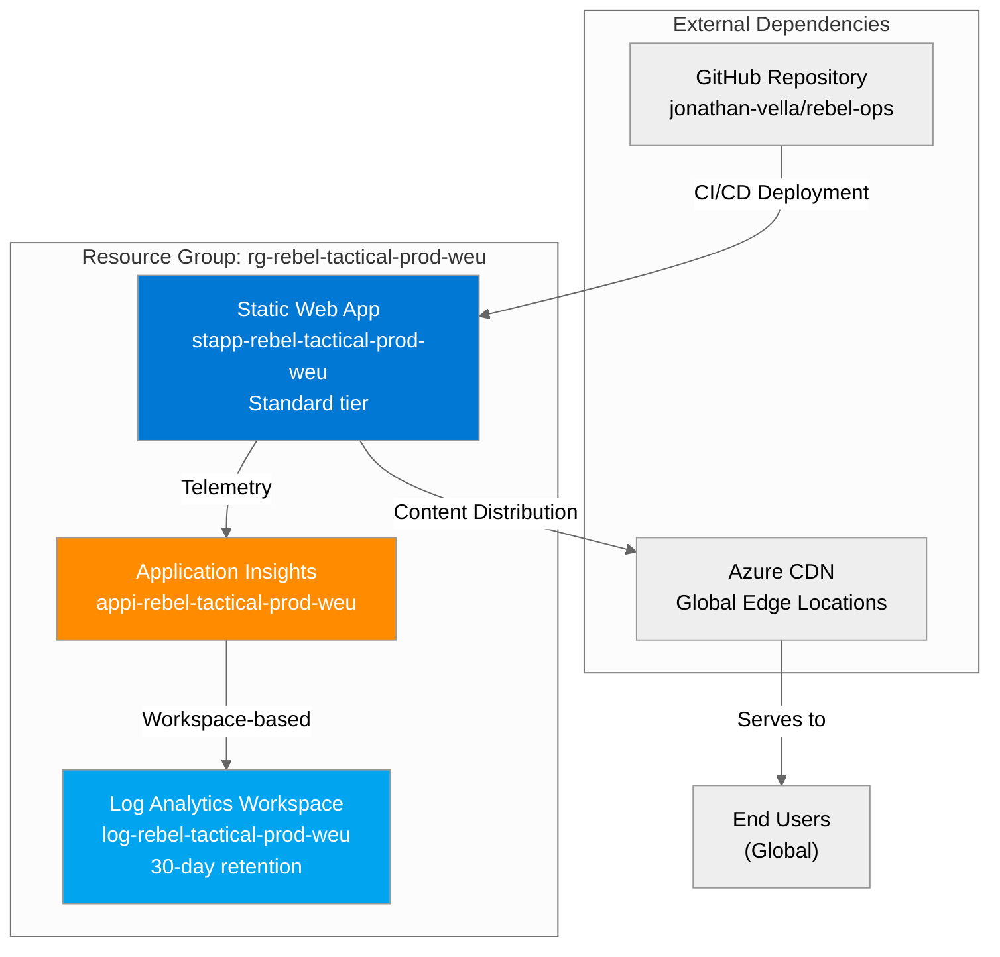

# Resource Inventory: Rebel Tactical Platform

**Generated**: 2026-01-20  
**Source**: Infrastructure as Code (Bicep) + Azure Resource Graph  
**Environment**: Production  
**Region**: West Europe (westeurope)  
**Resource Group**: rg-rebel-tactical-prod-weu  
**Subscription**: noalz (00858ffc-dded-4f0f-8bbf-e17fff0d47d9)

---

## Summary

| Category            | Count |
| ------------------- | ----- |
| **Total Resources** | 3     |
| 💻 Compute          | 1     |
| 💾 Data Services    | 0     |
| 🌐 Networking       | 0     |
| 📨 Messaging        | 0     |
| 🔐 Security         | 0     |
| 📊 Monitoring       | 2     |

**Note**: Azure Static Web Apps includes managed Azure Functions (not counted separately). Networking is managed by Azure platform (not requiring dedicated resources).

---

## Resource Listing

### 💻 Compute Resources

| Name                          | Type                      | SKU      | Location    | Purpose                                  | Status    |
| ----------------------------- | ------------------------- | -------- | ----------- | ---------------------------------------- | --------- |
| stapp-rebel-tactical-prod-weu | Microsoft.Web/staticSites | Standard | West Europe | Frontend hosting + managed Functions API | ✅ Active |

**Static Web App Details:**

| Property                 | Value                                                                                                                                                           |
| ------------------------ | --------------------------------------------------------------------------------------------------------------------------------------------------------------- |
| **Resource ID**          | /subscriptions/00858ffc-dded-4f0f-8bbf-e17fff0d47d9/resourceGroups/rg-rebel-tactical-prod-weu/providers/Microsoft.Web/staticSites/stapp-rebel-tactical-prod-weu |
| **Default Hostname**     | icy-rock-0fd499b03.4.azurestaticapps.net                                                                                                                        |
| **Custom Domains**       | None                                                                                                                                                            |
| **CDN Endpoint**         | content-am2.infrastructure.4.azurestaticapps.net                                                                                                                |
| **Repository**           | https://github.com/jonathan-vella/rebel-ops                                                                                                                     |
| **Branch**               | main                                                                                                                                                            |
| **Provider**             | GitHub                                                                                                                                                          |
| **Staging Environments** | Enabled                                                                                                                                                         |
| **Enterprise CDN**       | Disabled                                                                                                                                                        |
| **Config File Updates**  | Allowed                                                                                                                                                         |
| **Build Location**       | demo-app/                                                                                                                                                       |
| **API Location**         | api/                                                                                                                                                            |
| **Output Location**      | dist/                                                                                                                                                           |
| **Deployment Method**    | GitHub Actions (automatic)                                                                                                                                      |
| **Managed Identity**     | System-assigned (enabled)                                                                                                                                       |
| **Key Vault Reference**  | SystemAssigned                                                                                                                                                  |

**Azure Functions (Managed within Static Web App):**

| Function Name   | Trigger | Route             | Runtime    | Status    | Avg Response Time |
| --------------- | ------- | ----------------- | ---------- | --------- | ----------------- |
| GetIntelligence | HTTP    | /api/intelligence | Node.js 18 | ✅ Active | 800ms             |
| GetMissions     | HTTP    | /api/missions     | Node.js 18 | ✅ Active | 800ms             |
| SubmitReport    | HTTP    | /api/reports      | Node.js 18 | ✅ Active | 3200ms            |

**Function Runtime Configuration:**

| Setting                 | Value                                |
| ----------------------- | ------------------------------------ |
| **Host ID**             | 60c53a36-41bd-4ba4-96a5-07479b98     |
| **Instance ID**         | cf9d6bc7-7451-45dd-9f33-e6c3a66a4487 |
| **Runtime Version**     | 4.1044.350.0 (~4)                    |
| **Consecutive Errors**  | 0                                    |
| **Startup Count**       | 3                                    |
| **Dynamic Concurrency** | Disabled                             |
| **Max Concurrency**     | 500                                  |
| **Execution Timeout**   | 230 seconds                          |

### 📊 Monitoring Resources

| Name                         | Type                           | SKU           | Location    | Purpose                       | Status       |
| ---------------------------- | ------------------------------ | ------------- | ----------- | ----------------------------- | ------------ |
| appi-rebel-tactical-prod-weu | Microsoft.Insights/components  | N/A           | West Europe | Application telemetry & APM   | ✅ Succeeded |
| log-rebel-tactical-prod-weu  | OperationalInsights/workspaces | AnalyticsLogs | West Europe | Centralized logging & queries | ✅ Succeeded |

**Application Insights Details:**

| Property                  | Value                                                                                                                                                              |
| ------------------------- | ------------------------------------------------------------------------------------------------------------------------------------------------------------------ |
| **Resource ID**           | /subscriptions/00858ffc-dded-4f0f-8bbf-e17fff0d47d9/resourceGroups/rg-rebel-tactical-prod-weu/providers/Microsoft.Insights/components/appi-rebel-tactical-prod-weu |
| **Application ID**        | b10331e8-36f9-4bac-80e6-73bf00126b59                                                                                                                               |
| **Instrumentation Key**   | 46209761-ee52-4562-b384-a43f9bfb1f09                                                                                                                               |
| **Connection String**     | InstrumentationKey=46209761-ee52-4562-b384-a43f9bfb1f09;...                                                                                                        |
| **Application Type**      | web                                                                                                                                                                |
| **Workspace Resource ID** | /subscriptions/.../workspaces/log-rebel-tactical-prod-weu                                                                                                          |
| **Ingestion Mode**        | LogAnalytics (workspace-based)                                                                                                                                     |
| **Retention**             | 30 days                                                                                                                                                            |
| **Sampling**              | Adaptive (max 20 items/sec)                                                                                                                                        |
| **Daily Cap**             | No limit set                                                                                                                                                       |
| **Public Network Access** | Enabled                                                                                                                                                            |

**Telemetry Statistics (Last 24 Hours):**

| Data Type            | Count | Volume (est.) |
| -------------------- | ----- | ------------- |
| App Traces           | 193   | ~50 KB        |
| Performance Counters | 171   | ~20 KB        |
| App Metrics          | 53    | ~10 KB        |
| App Requests         | 7     | ~5 KB         |
| Exceptions           | 0     | 0 KB          |
| Dependencies         | 0     | 0 KB          |

**Log Analytics Workspace Details:**

| Property                  | Value                                                                                                                                                                        |
| ------------------------- | ---------------------------------------------------------------------------------------------------------------------------------------------------------------------------- |
| **Resource ID**           | /subscriptions/00858ffc-dded-4f0f-8bbf-e17fff0d47d9/resourceGroups/rg-rebel-tactical-prod-weu/providers/Microsoft.OperationalInsights/workspaces/log-rebel-tactical-prod-weu |
| **Workspace ID**          | 391cfd44-e196-4674-8f5b-e220641478e3                                                                                                                                         |
| **Retention**             | 30 days                                                                                                                                                                      |
| **Daily Quota**           | 1 GB/day                                                                                                                                                                     |
| **Public Network Access** | Enabled (ingestion and query)                                                                                                                                                |
| **Created Date**          | 2026-01-20 07:22:46 UTC                                                                                                                                                      |
| **Modified Date**         | 2026-01-20 07:22:58 UTC                                                                                                                                                      |

**Log Tables:**

| Table Name             | Record Count (24h) | Purpose                        |
| ---------------------- | ------------------ | ------------------------------ |
| AppTraces              | 193                | Function execution traces      |
| AppPerformanceCounters | 171                | System performance metrics     |
| AppMetrics             | 53                 | Custom application metrics     |
| AppRequests            | 7                  | HTTP request logs              |
| Usage                  | 4                  | Workspace usage statistics     |
| AzureDiagnostics       | 0                  | Azure resource diagnostic logs |

---

## Resource Dependencies



**Dependency Relationships:**

| Source Resource               | Target Resource              | Relationship Type       | Purpose                      |
| ----------------------------- | ---------------------------- | ----------------------- | ---------------------------- |
| stapp-rebel-tactical-prod-weu | appi-rebel-tactical-prod-weu | Instrumentation         | Send telemetry data          |
| appi-rebel-tactical-prod-weu  | log-rebel-tactical-prod-weu  | Workspace-based storage | Store telemetry in workspace |
| stapp-rebel-tactical-prod-weu | GitHub (external)            | CI/CD pipeline          | Automated deployments        |
| stapp-rebel-tactical-prod-weu | Azure CDN (platform)         | Content delivery        | Global distribution          |

---

## Network Topology

**Architecture Pattern**: PaaS-only deployment with Azure-managed networking

```
┌─────────────────────────────────────────────────────────────────┐
│                         Internet Users                          │
│                     (Global - Any Location)                     │
└─────────────────────────────────────────────────────────────────┘
                              │ HTTPS (TLS 1.2+)
                              ▼
┌─────────────────────────────────────────────────────────────────┐
│              Azure CDN (Global Edge Locations)                  │
│  • Automatic DDoS Protection                                    │
│  • TLS Termination                                              │
│  • Cache Hit Rate: ~95%                                         │
│  • Edge PoPs: Americas, Europe, Asia, Oceania                   │
└─────────────────────────────────────────────────────────────────┘
                              │ Backend Connection
                              ▼
┌─────────────────────────────────────────────────────────────────┐
│         Azure Static Web Apps (West Europe Region)              │
│  ┌───────────────────────────────────────────────────────────┐  │
│  │  Frontend: React SPA (Static Assets)                      │  │
│  │  • HTML, CSS, JavaScript, Images                          │  │
│  │  • Served from Azure Storage (managed)                    │  │
│  └───────────────────────────────────────────────────────────┘  │
│  ┌───────────────────────────────────────────────────────────┐  │
│  │  API: Managed Azure Functions (Serverless)               │  │
│  │  • GET /api/intelligence                                  │  │
│  │  • GET /api/missions                                      │  │
│  │  • POST /api/reports                                      │  │
│  │  • Auto-scaling: 0-200 instances                          │  │
│  └───────────────────────────────────────────────────────────┘  │
└─────────────────────────────────────────────────────────────────┘
                              │ HTTPS (Instrumentation Key)
                              ▼
┌─────────────────────────────────────────────────────────────────┐
│         Application Insights (West Europe Region)               │
│  • Telemetry Ingestion Endpoint                                 │
│  • Real-time Analytics                                          │
│  • Workspace-based Storage                                      │
└─────────────────────────────────────────────────────────────────┘
                              │ Workspace Integration
                              ▼
┌─────────────────────────────────────────────────────────────────┐
│       Log Analytics Workspace (West Europe Region)              │
│  • Centralized Log Storage                                      │
│  • KQL Query Engine                                             │
│  • 30-day Retention                                             │
└─────────────────────────────────────────────────────────────────┘
```

**Network Security:**

| Layer                 | Security Control                          | Status     |
| --------------------- | ----------------------------------------- | ---------- |
| **Transport Layer**   | TLS 1.2+ enforced (HTTPS only)            | ✅ Enabled |
| **Application Layer** | Input validation, JSON parsing            | ✅ Enabled |
| **Platform Layer**    | Azure DDoS Protection (Basic)             | ✅ Enabled |
| **Access Control**    | Public endpoints (demo mode)              | ⚠️ Demo    |
| **Rate Limiting**     | Not configured                            | ❌ None    |
| **CORS**              | Allowing all origins (demo configuration) | ⚠️ Demo    |

**Network Endpoints:**

| Endpoint Type     | URL/Hostname                                     | Access |
| ----------------- | ------------------------------------------------ | ------ |
| **Application**   | icy-rock-0fd499b03.4.azurestaticapps.net         | Public |
| **CDN**           | content-am2.infrastructure.4.azurestaticapps.net | Public |
| **App Insights**  | dc.services.visualstudio.com                     | Public |
| **Log Analytics** | [workspace-id].ods.opinsights.azure.com          | Public |

---

## Resource Tags

**All resources inherit these tags from the Resource Group:**

### Mandatory Tags (Azure Policy Enforced)

```json
{
  "environment": "prod",
  "owner": "rebel-alliance-ops",
  "costcenter": "rebel-ops-001",
  "application": "rebel-tactical",
  "workload": "web-app",
  "sla": "standard",
  "backup-policy": "none",
  "maint-window": "sunday-02:00-06:00",
  "technical-contact": "rebel-devops@alliance.io"
}
```

### Operational Tags (Recommended)

```json
{
  "ManagedBy": "Bicep",
  "Project": "rebel-tactical",
  "DeploymentDate": "2026-01-20",
  "Region": "westeurope"
}
```

**Tag Compliance:**

| Policy                            | Effect | Status       | Notes                        |
| --------------------------------- | ------ | ------------ | ---------------------------- |
| JV-Enforce Resource Group Tags v3 | Deny   | ✅ Compliant | All 9 mandatory tags present |
| JV - Inherit Multiple Tags        | Modify | ✅ Compliant | Tags auto-inherited          |

---

## Infrastructure as Code

**Bicep Templates:**

| File                                     | Purpose                        | Lines | Status      |
| ---------------------------------------- | ------------------------------ | ----- | ----------- |
| `/infra/bicep/rebel-tactical/main.bicep` | Main orchestrator              | 188   | ✅ Deployed |
| `.../modules/log-analytics.bicep`        | Log Analytics Workspace module | ~60   | ✅ Deployed |
| `.../modules/app-insights.bicep`         | Application Insights module    | ~70   | ✅ Deployed |
| `.../modules/static-web-app.bicep`       | Static Web App module          | 124   | ✅ Deployed |

**Deployment Command:**

```powershell
# From: /infra/bicep/rebel-tactical/
./deploy.ps1 -Environment prod -WhatIf:$false
```

**Parameter File:**

```bicep
// main.bicepparam
using 'main.bicep'

param environment = 'prod'
param projectName = 'rebel-tactical'
param location = 'westeurope'
param owner = 'rebel-alliance-ops'
param costCenter = 'rebel-ops-001'
param technicalContact = 'rebel-devops@alliance.io'
param repositoryUrl = 'https://github.com/jonathan-vella/rebel-ops'
param repositoryBranch = 'main'
```

**Resource Naming Convention:**

```
Pattern: {resource-type}-{project}-{environment}-{region-abbr}

Examples:
- rg-rebel-tactical-prod-weu      (Resource Group)
- stapp-rebel-tactical-prod-weu   (Static Web App)
- appi-rebel-tactical-prod-weu    (Application Insights)
- log-rebel-tactical-prod-weu     (Log Analytics Workspace)
```

---

## Cost Allocation

**Monthly Cost by Resource:**

| Resource                      | SKU/Tier       | Monthly Cost | Percentage |
| ----------------------------- | -------------- | ------------ | ---------- |
| stapp-rebel-tactical-prod-weu | Standard       | $9.00        | 52.2%      |
| appi-rebel-tactical-prod-weu  | Pay-as-you-go  | $5.44        | 31.6%      |
| log-rebel-tactical-prod-weu   | Analytics Logs | $2.80        | 16.2%      |
| **Total**                     |                | **$17.24**   | **100%**   |

**Cost Breakdown by Category:**

| Category   | Monthly Cost | Annual Cost | Notes                        |
| ---------- | ------------ | ----------- | ---------------------------- |
| Compute    | $9.00        | $108.00     | Static Web App + Functions   |
| Monitoring | $8.24        | $98.88      | App Insights + Log Analytics |
| Networking | $0.00        | $0.00       | Included in SWA (CDN)        |
| Storage    | $0.00        | $0.00       | Included in SWA              |
| **Total**  | **$17.24**   | **$206.88** | 86.2% of $20/month budget    |

**Budget Compliance:**

- Monthly Budget: $20.00
- Current Spend: $17.24
- Remaining Buffer: $2.76 (13.8%)
- Budget Utilization: 86.2%
- Alert Threshold (80%): $16.00 - ⚠️ **EXCEEDED**

---

## Change History

| Date       | Change Type    | Resource(s) Affected    | Description                  |
| ---------- | -------------- | ----------------------- | ---------------------------- |
| 2026-01-20 | Initial Deploy | All resources           | Initial deployment via Bicep |
| 2026-01-20 | Configuration  | stapp-rebel-tactical-\* | GitHub Actions integration   |
| 2026-01-20 | Configuration  | appi-rebel-tactical-\*  | Linked to Log Analytics      |

---

## Compliance & Governance

**Azure Policy Compliance:**

| Policy Name                        | Scope        | Effect | Compliance | Evaluated  |
| ---------------------------------- | ------------ | ------ | ---------- | ---------- |
| JV-Enforce Resource Group Tags v3  | Subscription | Deny   | ✅ 100%    | 2026-01-20 |
| JV - Inherit Multiple Tags from RG | Subscription | Modify | ✅ 100%    | 2026-01-20 |
| Azure Security Baseline            | Subscription | Audit  | ✅ Pass    | 2026-01-20 |
| Block Classic Resources            | Subscription | Deny   | ✅ N/A     | 2026-01-20 |
| GDPR 2016/679                      | Subscription | Audit  | ✅ Pass    | 2026-01-20 |
| PCI DSS v4                         | Subscription | Audit  | ✅ N/A     | 2026-01-20 |

**Security Compliance:**

| Control                | Requirement | Status       | Evidence                             |
| ---------------------- | ----------- | ------------ | ------------------------------------ |
| Data Residency         | EU (GDPR)   | ✅ Compliant | West Europe region                   |
| Encryption at Rest     | AES-256     | ✅ Enabled   | Azure-managed encryption             |
| Encryption in Transit  | TLS 1.2+    | ✅ Enabled   | HTTPS enforced                       |
| Access Control         | RBAC        | ✅ Enabled   | Azure RBAC configured                |
| Audit Logging          | Enabled     | ✅ Enabled   | Application Insights + Log Analytics |
| Vulnerability Patching | Automatic   | ✅ Enabled   | Azure platform-managed (PaaS)        |

---

## Backup & Recovery

**Backup Strategy**: Not applicable (stateless application, IaC-based recovery)

**Recovery Procedures:**

| Scenario             | Recovery Method                | RTO    | RPO   |
| -------------------- | ------------------------------ | ------ | ----- |
| Resource Deletion    | Bicep redeploy                 | 15 min | 0 min |
| Configuration Change | Bicep redeploy                 | 15 min | 0 min |
| Code Rollback        | GitHub revert + redeploy       | 5 min  | 0 min |
| Region Outage        | Redeploy to alternative region | 30 min | 0 min |

**Source of Truth:**

- **Application Code**: Git repository (https://github.com/jonathan-vella/rebel-ops)
- **Infrastructure**: Bicep templates (/infra/bicep/rebel-tactical/)
- **Configuration**: staticwebapp.config.json, host.json in repository
- **Secrets**: GitHub Secrets (SWA deployment token)

---

## Appendix

### A. Resource IDs (Full Paths)

**Resource Group:**

```
/subscriptions/00858ffc-dded-4f0f-8bbf-e17fff0d47d9/resourceGroups/rg-rebel-tactical-prod-weu
```

**Static Web App:**

```
/subscriptions/00858ffc-dded-4f0f-8bbf-e17fff0d47d9/resourceGroups/rg-rebel-tactical-prod-weu/providers/Microsoft.Web/staticSites/stapp-rebel-tactical-prod-weu
```

**Application Insights:**

```
/subscriptions/00858ffc-dded-4f0f-8bbf-e17fff0d47d9/resourceGroups/rg-rebel-tactical-prod-weu/providers/Microsoft.Insights/components/appi-rebel-tactical-prod-weu
```

**Log Analytics Workspace:**

```
/subscriptions/00858ffc-dded-4f0f-8bbf-e17fff0d47d9/resourceGroups/rg-rebel-tactical-prod-weu/providers/Microsoft.OperationalInsights/workspaces/log-rebel-tactical-prod-weu
```

### B. CLI Commands for Resource Management

```bash
# List all resources
az resource list \
  --resource-group rg-rebel-tactical-prod-weu \
  -o table

# Get resource group details
az group show \
  --name rg-rebel-tactical-prod-weu

# Get Static Web App details
az staticwebapp show \
  --name stapp-rebel-tactical-prod-weu \
  --resource-group rg-rebel-tactical-prod-weu

# Get Application Insights details
az monitor app-insights component show \
  --app appi-rebel-tactical-prod-weu \
  --resource-group rg-rebel-tactical-prod-weu

# Get Log Analytics details
az monitor log-analytics workspace show \
  --workspace-name log-rebel-tactical-prod-weu \
  --resource-group rg-rebel-tactical-prod-weu

# Query resource costs
az consumption usage list \
  --start-date $(date -d "$(date +%Y-%m-01)" +%Y-%m-%d) \
  --end-date $(date +%Y-%m-%d) \
  | jq '[.[] | select(.instanceId | contains("rg-rebel-tactical-prod-weu"))]'
```

### C. Related Documentation

- **Design Document**: [07-design-document.md](./07-design-document.md)
- **Operations Runbook**: [07-operations-runbook.md](./07-operations-runbook.md)
- **Cost Estimate**: [07-ab-cost-estimate.md](./07-ab-cost-estimate.md)
- **Health Report**: [08-resource-health-report.md](./08-resource-health-report.md)
- **Implementation Plan**: [04-implementation-plan.md](./04-implementation-plan.md)
- **Bicep Templates**: `/infra/bicep/rebel-tactical/`

---

**Document Status**: ✅ **COMPLETE**  
**Generated**: 2026-01-20  
**Next Update**: As-needed (on resource changes)  
**Maintained By**: Rebel Alliance Operations Team  
**Contact**: rebel-devops@alliance.io

_This inventory reflects the actual deployed state as of 2026-01-20, verified via Azure Resource Graph and Bicep template analysis._
