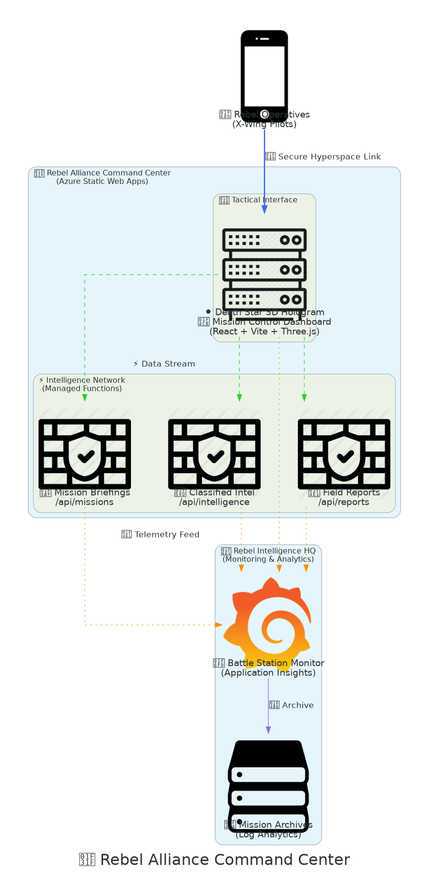
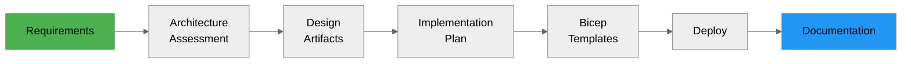

# 🌟 Rebel Alliance Tactical Infrastructure

> **Death Star Reconnaissance Platform** - Azure infrastructure engineered by AI agents for the Rebel Alliance

[](https://azure.microsoft.com/en-us/services/app-service/static/)
[](https://azure.microsoft.com/en-us/services/functions/)
[](https://react.dev/)
[](./LICENSE)

## Mission Brief

The Rebel Alliance requires a **secure tactical platform** for coordinating Death Star reconnaissance
operations. This repository demonstrates how **AI-powered agents** can transform military requirements into
production-ready Azure infrastructure using the **7-step Agentic InfraOps workflow**.

### Mission Objectives

- 🎯 **Interactive 3D Visualization** - Real-time Death Star tactical display using React Three Fiber
- 📡 **Intelligence API** - Serverless endpoints for mission data and reconnaissance reports
- 🛡️ **Secure Infrastructure** - Azure Static Web Apps with Application Insights monitoring
- 🤖 **Agent-Driven Deployment** - From requirements to deployment using GitHub Copilot agents

## Architecture



_Architecture diagram generated using Python's `diagrams` library. To regenerate: `python architecture-diagram.py`_

**Key Components:**

- **🚀 Frontend**: React + Vite with Three.js for 3D Death Star visualization
- **⚡ Managed API**: Three Azure Functions endpoints for missions, intelligence, and reports
- **🛡️ Monitoring**: Application Insights with Log Analytics for telemetry and mission logs
- **🌟 Platform**: Azure Static Web Apps (Standard tier) with integrated Functions

## Features

### 🚀 Frontend (demo-app/)

- **Interactive 3D Death Star** - Rotating model with key strategic features
- **Mission Dashboard** - Real-time status of reconnaissance operations
- **Target Analysis** - Exhaust port vulnerability assessments
- **Intelligence Feed** - Live updates from Bothan spies
- **React 18** + **Vite** for optimal performance

### ⚡ Serverless API (api/)

| Endpoint            | Method | Description                               |
| ------------------- | ------ | ----------------------------------------- |
| `/api/missions`     | GET    | Retrieve active reconnaissance missions   |
| `/api/intelligence` | GET    | Access classified Death Star intelligence |
| `/api/reports`      | POST   | Submit field reconnaissance reports       |

**Mock Data**: 5-10 canonical Star Wars missions including:

- Death Star weakness analysis
- Exhaust port thermal reconnaissance
- Shield generator intelligence
- TIE Fighter patrol patterns
- Superlaser charging cycle data

### 🛡️ Infrastructure (Bicep - Generated by Agents)

- **Azure Static Web Apps** (Standard tier with managed Functions)
- **Application Insights** (telemetry and monitoring)
- **Log Analytics Workspace** (centralized logging)
- **CAF Naming Standards** (e.g., `stapp-rebel-tactical-prod-weu`)
- **Required Tags** (Environment, Project, ManagedBy, Owner)

## Quick Start

### Prerequisites

- **Node.js 18+** and **npm**
- **Azure CLI 2.50+**
- **GitHub Copilot** (for agent workflow)
- **VS Code** with Dev Container support (optional)

### Local Development

```bash
# Clone the repository
git clone https://github.com/jonathan-vella/rebel-ops.git
cd rebel-ops

# Install frontend dependencies
cd demo-app
npm install
npm run dev

# In another terminal, install and run API locally
cd ../api
npm install
npm start

# Open http://localhost:5173
```

### Deploy to Azure

**Option 1: Using Agentic Workflow (Recommended)**

Follow the complete [7-step workflow](./DEMO-WORKFLOW.md) using GitHub Copilot agents:

1. **Requirements** → `project-planner` agent
2. **Architecture Assessment** → `azure-principal-architect` agent
3. **Design Artifacts** → `diagram-generator`, `adr-generator` agents
4. **Implementation Plan** → `bicep-plan` agent
5. **Bicep Templates** → `bicep-implement` agent
6. **Deployment** → `deploy` agent
7. **Documentation** → `workload-documentation-generator` agent

**Option 2: Manual Deployment**

```bash
# Build and deploy (requires Azure Static Web Apps CLI)
cd demo-app
npm run build

az staticwebapp create \
  --name rebel-tactical-demo \
  --resource-group rg-rebel-alliance-prod \
  --location westeurope \
  --sku Standard

# GitHub Actions will handle subsequent deployments
```

## Project Structure

```
rebel-ops/
├── demo-app/                    # React frontend
│   ├── src/
│   │   ├── App.jsx             # Main application
│   │   ├── components/
│   │   │   ├── DeathStar3D.jsx # Three.js visualization
│   │   │   ├── MissionBriefing.jsx
│   │   │   └── IntelligenceFeed.jsx
│   │   └── services/
│   │       └── apiClient.js    # API integration
│   ├── public/
│   ├── index.html
│   ├── vite.config.js
│   └── staticwebapp.config.json
│
├── api/                         # Azure Functions
│   ├── GetMissions/
│   │   ├── function.json
│   │   └── index.js
│   ├── GetIntelligence/
│   │   └── index.js
│   ├── SubmitReport/
│   │   └── index.js
│   └── host.json
│
├── requirements.md              # Pre-filled requirements for agents
├── DEMO-WORKFLOW.md             # Step-by-step agent guide
└── .github/
    └── workflows/
        └── azure-static-web-apps.yml
```

## Security Considerations

### Demo Configuration (Current)

⚠️ **This is a demonstration deployment** optimized for ease of access:

- ✅ HTTPS enforced (Static Web Apps default)
- ✅ TLS 1.2+ (platform managed)
- ⚠️ **Unauthenticated API endpoints** (demo only)
- ⚠️ No rate limiting
- ⚠️ Public network access enabled

### Production Requirements

Before deploying to production, implement:

1. **Authentication & Authorization**
   - Enable Azure AD via Static Web Apps Easy Auth
   - Configure role-based access control (RBAC)
   - Implement API key validation

2. **Network Security**
   - Azure Front Door with Web Application Firewall (WAF)
   - CORS restrictions (specific origins only)
   - DDoS Protection Standard

3. **Monitoring & Compliance**
   - Application Insights alerts and dashboards
   - Azure Policy for continuous compliance
   - Audit logging for all API access

> **Azure Policy Note**: This demo deploys unauthenticated APIs. Ensure your subscription doesn't have
> policies requiring Azure AD authentication for all PaaS services or private endpoint enforcement.

## Cost Estimates

| Resource             | SKU           | Monthly Cost (USD) |
| -------------------- | ------------- | ------------------ |
| Static Web App       | Standard      | $9.00              |
| Application Insights | Pay-as-you-go | ~$5.00             |
| Log Analytics        | Pay-as-you-go | ~$2.00             |
| **Total**            |               | **~$16/month**     |

_Estimates based on low-traffic demo usage (~1,000 requests/month)_

## Technologies

| Category           | Stack                                           |
| ------------------ | ----------------------------------------------- |
| **Frontend**       | React 18.2, Vite 5, React Three Fiber, Three.js |
| **API**            | Azure Functions (Node.js 18), HTTP triggers     |
| **Infrastructure** | Azure Static Web Apps, Bicep IaC                |
| **Monitoring**     | Application Insights, Log Analytics             |
| **Deployment**     | GitHub Actions, Azure CLI                       |
| **AI Agents**      | GitHub Copilot custom agents                    |

## Demo Workflow

This repository demonstrates the **Azure Agentic InfraOps** methodology:



See [DEMO-WORKFLOW.md](./DEMO-WORKFLOW.md) for detailed instructions.

## Contributing

This is a demonstration repository. To adapt for your own projects:

1. Fork this repository
2. Update `requirements.md` with your project details
3. Run through the 7-step agentic workflow
4. Customize the frontend theme and API endpoints

## License

MIT License - See [LICENSE](./LICENSE) file for details.

## Acknowledgments

- **Star Wars Universe** - Lucasfilm Ltd. (all trademarks and copyrights respected)
- **Azure Agentic InfraOps** - Methodology and agent definitions
- **GitHub Copilot** - AI-powered development workflow
- **The Bothans** - Many Bothans died to bring us this infrastructure

---

**May the Force be with your deployments** 🌟

_Built with ❤️ by the Rebel Alliance Engineering Corps_
